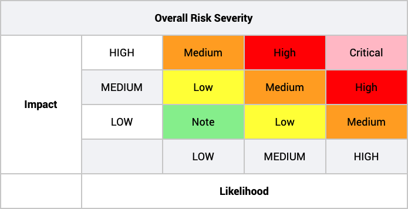

# RAB - Review, Audit, Bounty

## Classifiers


This is not meant to be a guide on what are vulnerabilities or how to find them, but instead is a standard for tracking work and managing resources along the process of securing a contract. If you'd like to learn more about vulnerabilities, the [Solidity Docs](https://solidity.readthedocs.io) and [this article](https://blog.sigmaprime.io/solidity-security.html) are a good place to start.


In the context of reviews, audits and bounties, findings have to be pointed out and will be evaluated following the [OWASP](https://owasp.org/www-community/OWASP_Risk_Rating_Methodology) risk rating model, illustrated by the Impact-Likelihood table:



In addition to the severity classification, emphasis should be put in writing clear descriptions, adding tests and instructions for facilitating reproduceability and including potential fixes if known.


## RAB Pragmas

We propose a standard for keeping track of a contract's flow through RAB that will be enforced along with the rest of our [Solidity Code Style & Guidelines](../code-style-and-guidelines/solidity.md). It consists of the following comment at the start of each file that is going through RAB. RAB is a never ending process, contracts should never be deemed fully secure:


```javascript
/**
 *  @authors: <Github username or email list.>
 *  @reviewers: <Github username or email list.>
 *  @auditors: <Github username, email, or audit program URI list.>
 *  @bounties: <Bounty program URI list.>
 *  @deployments: <Commit hash@contract address list.> (// For RABd)
 */
 
 @pragma...
```


The following are valid lists:

| 0 Members | 1 Member | 2 or Members |
| :--- | :--- | :--- |
| \[\] | \[@githubUsername\] | \[@githubUsername, @githubUsername\] |


RAB is a never ending process, contracts should never be deemed fully secure.


If a review, audit, bounty, or deployment becomes stale. I.e. the file is modified after the fact. An asterisk should be added to the end of each item in all the lists, like so, `[@githubUsername*, @githubUsername*]`.

## Review


All reviews should be performed on code that is in the `master` branch to avoid version confusion.


### Pre-Review

The purpose of the pre-review is to prepare the contract for a full review team review. First reviews usually catch a lot of the same issues and it'd be wasteful to have everyone catch them in parallel.

Once the author/s of a contract think it is ready, they:

1. [x] Make sure the contract file has the RAB pragma comment.
2. [x] Create an issue titled "Pre-Review &lt;SmartContract&gt;".
3. [x] Label it with the appropriate priority, appropriate status, and "maintenance" type.
4. [x] Assign it to a team member for review.

The reviewer then does the following:

1. Writes their review directly in a comment on the issue or posts a URI that links to it.
2. Waits for the author/s to implement any necessary changes.
3. Verifies all necessary changes have been implemented and adds their name to the RAB pragma comment's reviewers list, closing the issue.


Adding your name as a reviewer implies you approve the contract and deem it vulnerability free, to the best of your knowledge.


### Full Review

The flow for a full review is the same as the one for a pre-review, with the following differences:

* "Pre-/pre-" gets removed from the issue title.
* The whole review team gets assigned to the issue.
* The whole review team submits their reviews, verifies all necessary changes were implemented, and adds their name to the RAB pragma comment's reviewers list.


Reviews are only the first step in securing a contract. A contract should not be deemed production ready at this point. Internal reviews are riddled with inherent drawbacks and a third party audit and bug bounty should always back them up.


## Audit \(Optional\)

Internal reviews have many inherent drawbacks. Third party audits address the following ones and more:

| Dilution of Responsibility | Failure to See One's Own Mistakes | Error Probability |
| :--- | :--- | :--- |
| Third parties get paid specifically to find vulnerabilities first, and most of the time their payout increases when they do. They compete with each other instead of relying on each other. | A lot of the time, people read over a mistake they made and don't recognize it, just like when they made it. If a lot of team members worked on the same contract, this can be problematic. Third parties fix this. | If a reviewer has a X% chance of finding a vulnerability, adding reviewers logarithmically increases our total chance. |

Once the review process is completed, a review team member is assigned with finding a third party or third parties to audit the contract. This assignee will:

1. [x] Create an issue titled "Audit &lt;SmartContract&gt;".
2. [x] Label it with the appropriate priority, appropriate status, and "maintenance" type.
3. [x] Assign it to himself.

The assignee then waits for all the audits to finish and:

1. Posts all of the audits on the issue.
2. If changes are required, assigns the author/s to the issue and waits for them to be implemented.
3. Verifies all necessary changes have been implemented and adds the auditor/s to the RAB pragma comment's auditors list, closing the issue.

## Bounty

Bounties come with all the benefits of third party audits, but usually pay higher rewards and the payout policy is strictly based on vulnerabilities found. Generally, the more dangerous the vulnerability, the higher the payout.

The flow for bounties is just like the one for audits, but "A/audit" gets replaced by "B/bounty", and auditors are replaced by bounty campaigns or programs.

