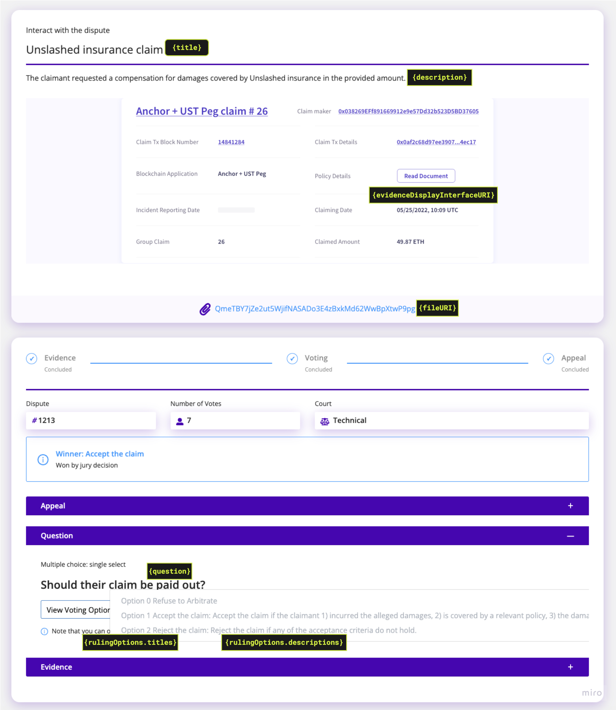

# ERC 1497: Evidence Standard

📖 [Link to full ERC-1497 documentation](https://developer.kleros.io/en/latest/erc-1497.html) 📖‌

📜 [EIP-1497](https://github.com/ethereum/EIPs/issues/1497) 📜

### Abstract

The following describes the standards for `MetaEvidence` and `Evidence` for dispute resolution. `Evidence` is provided by a participant in a dispute in order to support their assertion. `MetaEvidence` gives context to the dispute so that arbitrators are able to accurately and fairly evaluate it. This standard follows [ERC 792](https://github.com/ethereum/EIPs/issues/792) and references `Arbitrator` and `Arbitrable` contracts.

### Motivation

Standardizing `MetaEvidence` and `Evidence` allows interoperability between `Arbitrable` DApps (DApps where disputes can arise) and `Arbitrator` DApps (DApps which can be used to resolve disputes). It allows these applications to easily switch from one arbitration service to another, or to let their users decide which arbitration service to use without having to spend time to integrate with all of them. `MetaEvidence` is required to provide the context of the dispute. `Evidence` allows for dispute participants to submit extra information for the arbitrators.

The ERC792 standardizes the way the smart contracts interact with each other while this standard is made to standardize the way the interfaces interact in the context of disputes.

 (2) (2) (2) (2) (2) (2) (1) (1) (1) (1).png>)

### Evidence Interface

```solidity
// SPDX-License-Identifier: MIT
pragma solidity ^0.8.0;

import "../IArbitrator.sol";

/** @title IEvidence
 *  ERC-1497: Evidence Standard
 */
interface IEvidence {
    /**
     * @dev To be emitted when meta-evidence is submitted.
     * @param _metaEvidenceID Unique identifier of meta-evidence.
     * @param _evidence IPFS path to metaevidence, example: '/ipfs/QmbsNh1pDfqKmaySamNCnEoWQpd8E7RfpBrF3HPZS7xKVK'
     */
    event MetaEvidence(uint256 indexed _metaEvidenceID, string _evidence);

    /**
     * @dev To be raised when evidence is submitted. Should point to the resource (evidences are not to be stored on chain due to gas considerations).
     * @param _arbitrator The arbitrator of the contract.
     * @param _evidenceGroupID Unique identifier of the evidence group the evidence belongs to.
     * @param _party The address of the party submiting the evidence. Note that 0x0 refers to evidence not submitted by any party.
     * @param _evidence IPFS path to evidence, example: '/ipfs/Qmarwkf7C9RuzDEJNnarT3WZ7kem5bk8DZAzx78acJjMFH/evidence.json'
     */
    event Evidence(
        IArbitrator indexed _arbitrator,
        uint256 indexed _evidenceGroupID,
        address indexed _party,
        string _evidence
    );

    /**
     * @dev To be emitted when a dispute is created to link the correct meta-evidence to the disputeID.
     * @param _arbitrator The arbitrator of the contract.
     * @param _disputeID ID of the dispute in the Arbitrator contract.
     * @param _metaEvidenceID Unique identifier of meta-evidence.
     * @param _evidenceGroupID Unique identifier of the evidence group that is linked to this dispute.
     */
    event Dispute(
        IArbitrator indexed _arbitrator,
        uint256 indexed _disputeID,
        uint256 _metaEvidenceID,
        uint256 _evidenceGroupID
    );
}
```

## Introduction to the Evidence Standard

The purpose of this specification is to create a standard way for DApps that are part of the dispute resolution process to share context and information. This standard should allow DApps that have disputes they need arbitrated a way to provide the details of the dispute to the Arbitrator. Conversely, for an Arbitrator interface to be able to display a dispute to be ruled on, there needs to be a standard way for the interface to fetch evidence from the Arbitrable contracts.

\
Let’s consider an example where a developer is asked to develop an e-commerce website. The contracting party locks up the payment for the website in an escrow smart contract. Unfortunately, once the developer submits her work, there is a disagreement on whether the terms have been met and a dispute is raised in the smart contract. Now the case will go to an arbitration service, but in order for the arbitrators to make a fair ruling, they need to understand what the dispute is about and to take into consideration the arguments from both parties.

In essence, there are two kinds of evidence needed for the arbitrators to be able to make a ruling.

The first type of evidence, called MetaEvidence, provides the whole picture behind the dispute. In this case, it could be the original off-chain contract or agreement, as well as important information regarding what consequence(s) an arbitrator's ruling will have. MetaEvidence is used to convey this information to the chosen arbitrator.

The second type is the material evidence, such as emails, screenshots and contracts or testimony provided by each party to try to prove that the dispute should be ruled in their favor. In the above case, the programmer might submit the code as evidence, while the contracting party submits screenshots of what is missing.

In the case of our Evidence Standard, MetaEvidence is the context while Evidence is the proof provided by each party.

## How it works

\
In order to provide flexibility for all different types of disputes, and to try to keep minimal information on the chain, we decided to create standardized JSON objects that can be hosted anywhere and fetched by an interface to display a dispute. Below we provide some examples. For more information on what each field does, take a look at the [standard specification](https://github.com/ethereum/EIPs/issues/1497).

### MetaEvidence: <a href="#metaevidence" id="metaevidence"></a>

We have already discussed what MetaEvidence is, so let’s take a look at how a piece of MetaEvidence might actually look and how it would be used. Each dispute has one piece of MetaEvidence that is used to give all of the contextual information for a contract that might be disputed. MetaEvidence should be created at the same time as the agreement so that it can be impartial. The only restriction on MetaEvidence is that it must be created before a dispute can be raised in the smart contract.

The fields in this MetaEvidence JSON are as follows:

* `category`: The category that the dispute belongs to. All values are accepted here, but it's good to align it with other past disputes of the same kind for consistency.
* `title`: A title to describe what the dispute is about. Can be constant for all disputes from your dApp.
* `description`: Text to describe the situation of the case. It can also be static for all cases, in which you will just have a generic description that describes what to look out for in these cases.
* `question`: This is question posed to the jury after they review all the facts, documents and evidences of the case.
* `rulingOptions`:
  * type: Can be one of the following values:
    * `single-select`: the jurors select one answer among the provided options.
    * `multiple-select`: the jurors can select any number of the provided options.
    * `uint`: the jurors input an unsigned integer.
    * `int`: the jurors input a signed integer.
    * `string`: the jurors enter a string. String must fit into `bytes32`.
  * `precision`: only applicable for ruling types `int` and `uint` to indicate the number of decimal places a ruling contains.
  * `titles`: an array of the options available to the jurors. NOTE: the sequence of the titles is important as they map directly to the rulings you get when the Arbitrator responds to your Arbitrable using the `rule()` function.
  * `descriptions`: the description of the `rulingOption` titles.
*   `fileURI`: The URI points to the primary document of the case, which is the foundational document that establishes the rules for the dispute. This document is typically a dispute policy that defines criteria for resolution and serves as the basis for jurors to make their decisions. We have established dispute policies for the following products that can be referenced:&#x20;

    * **Kleros Scout**
      * [ATR (Address Tag Registry)](https://ipfs.kleros.io/ipfs/QmXuUER9is6n4XgiDtNnZBqPCTsJvMj1ku5gQg5EZGxfxw/atr-registry-policy.pdf)
      * [CDN (Curated Domain Names)](https://ipfs.kleros.io/ipfs/QmVL3hR8E2XcnJ1PjKARqh7e5SDJM1HeKLsUYnLnUyKEWo/domain-name-dispute-resolution-policy-v1.0.pdf)
      * [Snap](https://ipfs.kleros.io/ipfs/QmcARXVNcX8LpvjMZDgL8AQyW8q1XxwMfVTPSJ3YRvCpvx/snap-dispute-policy.pdf)
    * **Oracle**
      * [Oracle Dispute Policy](https://ipfs.kleros.io/ipfs/QmfHRnNnBxxa1uD5MKP2HNrB8hWjHsrNfqaLetiEa8LfaT/reality-eth-dispute-policy.pdf)
    * **Court**
      * [Court Policies](https://ipfs.kleros.io/ipfs/QmZYxRxwKMPpSMq8MJSd5QFeSUZoii7hFwXJvQn7bvnbCq/kleros-court-justice-policy.pdf)
    * **Governor**
      * [Governor Policy](https://ipfs.kleros.io/ipfs/QmVMqK7yXTXVXzLGJgT1XLJeaWD5LJhN2A2PrqMM41BbWY/kleros-governor-policy.pdf)
    * **Proof of Humanity**
      * [PoH v2 Policy](https://ipfs.kleros.io/ipfs/QmNSV9xXKiBtaRW1MYmFaVkqsD1Qez2ZDX1jyP21j87jxj/poh-v2-policy.pdf)

    For guidance on creating your own dispute policy document, please refer to our [Policy Writing Guide](https://docs.kleros.io/integrations/policy-writing-guide).
*   `evidenceDisplayInterfaceURI`: This field provides a URI that points to a display interface for rendering evidence in a more user-friendly way for arbitrators.

    **Core purpose:**

    * Creates a custom UI for presenting evidence within the arbitration interface
    * Allows for branded, styled presentation of dispute evidence
    * Renders in an iframe within the arbitrator's interface

    **The query parameters passed to it include:**

    * `disputeID`: Identifier for the specific dispute
    * `chainID`: The blockchain network ID
    * `arbitratorContractAddress`: Address of the arbitrator contract
    * `arbitratorJsonRpcUrl`: JSON-RPC endpoint for the arbitrator's blockchain
    * `arbitratorChainID`: Chain ID for the arbitrator
    * `arbitrableContractAddress`: Address of the arbitrable contract
    * `arbitrableChainID`: Chain ID for the arbitrable contract
    * `arbitrableJsonRpcUrl`: JSON-RPC endpoint for the arbitrable contract's blockchain
    * `jsonRpcUrl`: General JSON-RPC URL for the arbitrator's environment (typically Ethereum mainnet or Gnosis Chain)

    While there are no hard limits to the amount of content that can be displayed, it's recommended to keep the interface under 360px in height to ensure it's easily readable within the court interface.

    **When to use it:**

    1. **Complex Financial Transactions**: For payment histories, multi-party transactions, or time-series data that benefits from visualization.
    2. **Evidence Context and Relationships**: Standard evidence attachments are recommended for both textual and non-textual evidence, but the display interface can organize these attachments, provide context, and visualize relationships between different evidence elements.
    3. **Branded Experience**: When maintaining your application's visual identity throughout the dispute resolution process is important. \
       **Examples:** [escrow](https://github.com/kleros/escrow-evidence-display), [reality same chain](https://github.com/kleros/realitio-interface), [reality cross-chain](https://github.com/kleros/cross-chain-realitio-proxy/tree/master/evidence-display), [curate](https://github.com/kleros/gtcr-injected-uis)
*   `dynamicScriptURI`: This field provides a URI to a script that can dynamically update the MetaEvidence when it's fetched by an arbitrator interface. This script must expose a function called `getMetaEvidence` that returns JSON data, which is then merged with the original MetaEvidence JSON.

    **Core purpose:**

    * Makes MetaEvidence more dynamic without requiring on-chain updates
    * Reduces gas costs by avoiding repeated on-chain MetaEvidence updates
    * Provides flexibility for disputes with changing content or context

    **When to use it:**

    1. **Template-Based Disputes**: For similar disputes with different parameters.
    2. **Gas Optimization**: When emitting new MetaEvidence events for each dispute would be prohibitively expensive.
    3. **Dynamic Content**: When dispute details aren't fully known at contract creation time but follow a predictable pattern.\
       **Examples:** [reality same chain](https://github.com/kleros/realitio-script), [reality cross-chain](https://github.com/kleros/cross-chain-realitio-proxy/tree/master/dynamic-script)

| If you need to                          | Consider using              |
| --------------------------------------- | --------------------------- |
| Visualize transaction flows             | evidenceDisplayInterfaceURI |
| Show relationships between evidence     | evidenceDisplayInterfaceURI |
| Maintain brand identity in disputes     | evidenceDisplayInterfaceURI |
| Handle many similar disputes            | dynamicScriptURI            |
| Reduce gas costs for many disputes      | dynamicScriptURI            |
| Adapt MetaEvidence at runtime           | dynamicScriptURI            |
| Complex visualization + dynamic content | Both fields together        |

**Using Both Fields Together**

When your dispute resolution needs are complex, you can use both fields together in the same MetaEvidence. This allows you to have both dynamic content and custom visualization.


Here's an example of a MetaEvidence JSON:

```json
{
  "category": "Insurance",
  "title": "Unslashed insurance claim",
  "description": "The claimant requested a compensation for damages covered by Unslashed insurance in the provided amount.",
  "question": "Should their claim be paid out?",
  "rulingOptions": {
    "type": "single-select",
    "titles": [
      "Accept the claim",
      "Reject the claim"
    ],
    "descriptions": [
      "Accept the claim if the claimant 1) incurred the alleged damages, 2) is covered by a relevant policy, 3) the damages and their cover are at least the claimed amount at the moment when the claim was filled.",
      "Reject the claim if any of the acceptance criteria do not hold."
    ]
  },
  "fileURI": "/ipfs/QmeTBY7jZe2ut5WjifNASADo3E4zBxkMd62WwBpXtwP9pg",
  "evidenceDisplayInterfaceURI": "https://app.unslashed.finance/embed/claims"
}
```

Below you will find a diagram that shows how the elements in the MetaEvidence JSON get displayed on the [Court](https://court.kleros.io/cases/1213) and [Dispute Resolver](https://resolve.kleros.io/cases/1213) interfaces.

<figure><figcaption><p>A screenshot of <a href="https://resolve.kleros.io/cases/1213">Case #1213 on resolve.kleros.io</a>, showcasing all the important elements in the MetaEvidence JSON of this case.</p></figcaption></figure>


Here is an example of the URL with query string used by the iframe on the Arbitrator interface:

```typescript
// URL decoded example for readability
https://cdn.kleros.link/ipfs/QmSL8d82dMhcThwERWaF4LtmCa4hgV7TyPjAo4fKCzPVkv/index.html?{"disputeID":"1500","chainID":1,"arbitratorContractAddress":"0x988b3a538b618c7a603e1c11ab82cd16dbe28069","arbitratorJsonRpcUrl":"https://eth-mainnet.alchemyapi.io/v2/uL6wnCNAu31Wh7c5P5NWPwD-ZYc2LTKh","arbitratorChainID":1,"arbitrableContractAddress":"0xC5E9dDebb09Cd64DfaCab4011A0D5cEDaf7c9BDb","arbitrableChainID":1,"arbitrableJsonRpcUrl":"https://eth-mainnet.alchemyapi.io/v2/uL6wnCNAu31Wh7c5P5NWPwD-ZYc2LTKh","jsonRpcUrl":"https://eth-mainnet.alchemyapi.io/v2/uL6wnCNAu31Wh7c5P5NWPwD-ZYc2LTKh"}
```


Pro-tip: To avoid having to create a new MetaEvidence JSON and pin it to IPFS prior to every dispute, you can use just a static MetaEvidence JSON, and use a `evidenceDisplayInterfaceURI` that dynamically displays different information based on the query string.


### Evidence: <a href="#evidence" id="evidence"></a>

It is also essential in many types of disputes that the participants have a chance to show their viewpoint and give reasons why they believe they are right. Therefore there needs to be a way for an Arbitrator to receive Evidence. The Evidence JSON file includes the following properties:

```json
{
	"fileURI": "/ipfs/QmWQV5ZFFhEJiW8Lm7ay2zLxC2XS4wx1b2W7FfdrLMyQQc",
	"fileHash": "QmWQV5ZFFhEJiW8Lm7ay2zLxC2XS4wx1b2W7FfdrLMyQQc",	
	"fileTypeExtension": "pdf",
	"name": "Email clarifying the terms of the contract.",
	"description": "This is an email sent to Alice from Bob that clarifies that the recommendation page that was expected",
	"selfHash": "QmUQMJbfiQYX7k6SWt8xMpR7g4vwtAYY1BTeJ8UY8JWRs9"
}
```

#### How to use these JSON files: <a href="#how-to-use-these-json-files" id="how-to-use-these-json-files"></a>

So now we have JSON files with our two types of evidence but we still need a way to link them to our smart contract so that our DApps can interact seamlessly. MetaEvidence and Evidence are submitted and looked up via smart contract event logs. The standard specifies some new events for your smart contracts. When an Evidence is submitted, an event is raised that includes a URI to the JSON file that the submitter can host anywhere they choose. This way we can leverage the immutability and availability of the blockchain to create a permanent log of submission that any interface can look up and use to access the Evidence JSON.\\

#### Keeping the data safe with hashes: <a href="#keeping-the-data-safe-with-hashes" id="keeping-the-data-safe-with-hashes"></a>

In contentious disputes, it is crucial that Arbitrators can be sure that they receive accurate Evidence and MetaEvidence. For example, if MetaEvidence is tampered with, one of the participants can switch the labels on the ruling options, and an Arbitrator might send funds to the wrong party thinking they are voting the opposite way. To protect against Evidence or MetaEvidence being modified, a series of hashes are used. The JSON for both MetaEvidence and Evidence contains hash fields for things such as linked files. The standard also allows for the hash to be used as the name of the file, like the format IPFS uses, so that files hosted on distributed platforms that guarantee data integrity don’t require any extra work. The arbitrators can use these hashes that are provided when Evidence or MetaEvidence is submitted to verify that nothing has been changed.
