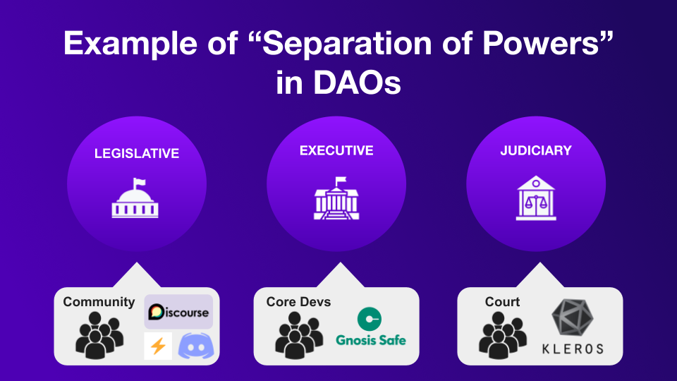
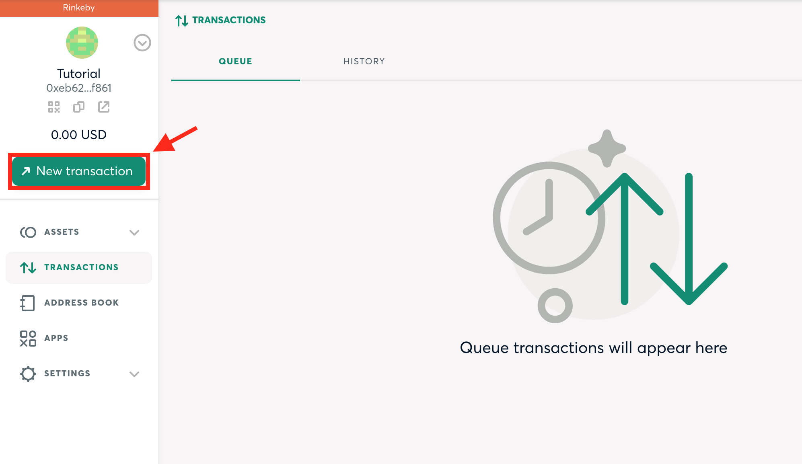
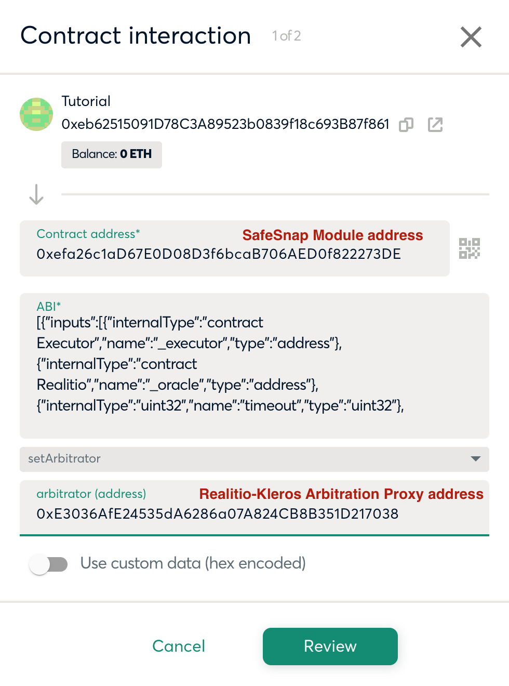
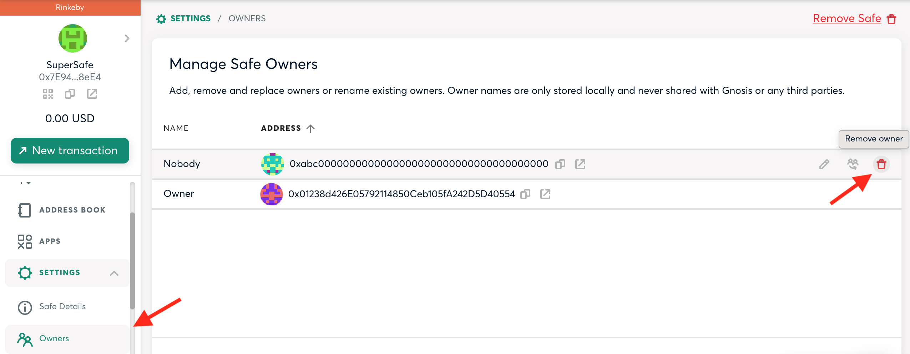
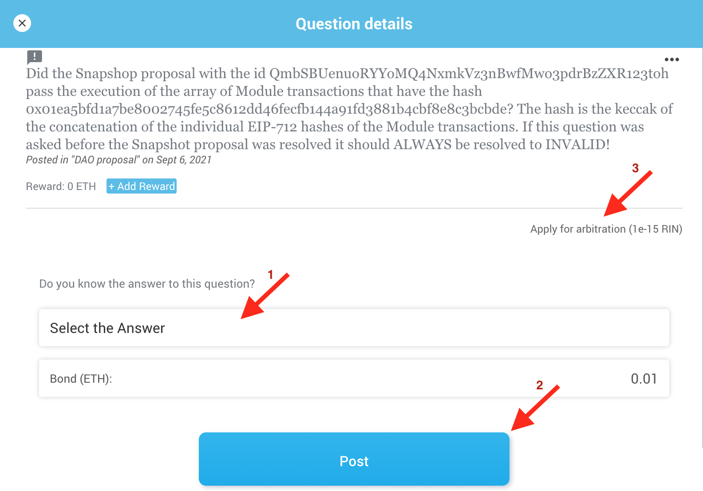
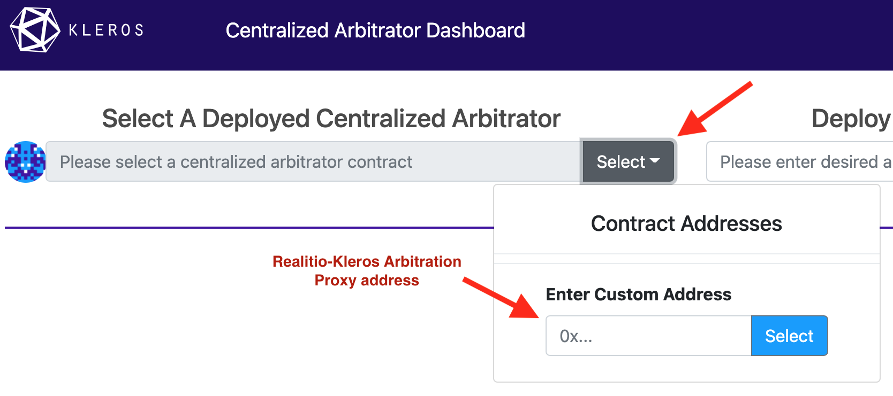

# How to Create Truly Decentralized Governance

This is a tutorial following a previous governance [blogpost](https://blog.kleros.io/kleros-x-safesnap/) and inspired by the [separation of powers in DAOs](https://www.youtube.com/watch?v=HDSZsl1Zk4c) talk given by Jimmy Ragosa at the ETHCC4. Here, you will learn how to make your DAO fully decentralized using:

- [Gnosis Safe](https://gnosis-safe.io/): one of the leading multi-signature wallets used by companies to manage their crypto assets.
- [Snapshot](https://snapshot.org/#/): a platform widely used for off-chain vote signaling.
- [Gnosis SafeSnap](https://blog.gnosis.pm/introducing-safesnap-the-first-in-a-decentralized-governance-tool-suite-for-the-gnosis-safe-ea67eb95c34f): a Gnosis Safe module that allows trustless on-chain execution of off-chain votes using [Realitio](https://reality.eth.link/) (an escalation-game-based oracle).
- [Kleros](https://kleros.io/): the decentralized dispute resolution platform and the final piece of this governance system puzzle, as it secures the Realitio outcome.

## Motivation

You might be wondering why do we need so many blocks to achieve decentralized governance. Let's imagine that your project's treasury and smart contracts are managed by a multisig owned by team members. Furthermore, its token holders can use the project's Snapshot space to vote proposals, which should be carried out if successful, technically feasible and aligned with the project's mission. The big question is how do token holders make sure that the multisig owners will act accordingly.

We can interpret this as a power play between an executive team performing actions and a legislative branch voting about what actions should be taken. The missing piece is a process secured by the equivalent to the judiciary power, which enforces the token holders decisions on-chain. Here is where SafeSnap and Kleros come in.

## Let's Put the Puzzle Together

We will dive into integrating the Gnosis SafeSnap module and Kleros with an existing DAO. For this, you will need a Gnosis Safe (learn more about it [here](https://gnosis-safe.io/#getting-started)). For testing purposes, we are going to use the [Safe App in rinkeby](https://rinkeby.gnosis-safe.io/). We are also going to be using the tools available in the Kleros' [dao-module repository](https://github.com/kleros/dao-module), so clone it and create an .env file with your parameters as shown in the [sample file](https://github.com/kleros/dao-module/blob/main/.env.sample). Before start using it, make sure to install the dependencies with `yarn` and compile the contracts with `yarn build`.

The first part of the guide will use the Rinkeby ETH Realitio v2.1 contract at [`0xa09ce5e7943f281a782a0dc021c4029f9088bec4`](https://rinkeby.etherscan.io/address/0xa09ce5e7943f281a782a0dc021c4029f9088bec4#code). 

In order to setup your DAO on Mainnet, jump to the [Mainnet Setup](#mainnet) section.

## Adding the SafeSnap Module

SafeSnap allows anyone to propose on-chain transactions that will be executed by the DAO. Whether each batch of transactions gets executed or not depends on the Realitio's outcome, based on the DAO's proposal rules. Everyone can participate in Realitio by providing an answer with a bond in ETH or in the DAO's token and request arbitration for disputed proposals.

Let's start by deploying the SafeSnap module. 
1. Create a sample question template running `yarn hardhat --network rinkeby createDaoTemplate --oracle 0xa09ce5e7943f281a782a0dc021c4029f9088bec4`. This should provide you with a template id. For this guide we will assume that the returned template id is `0x0000000000000000000000000000000000000000000000000000000000000dad`.
1. Deploy the module: `yarn hardhat --network rinkeby setup --dao <safe_address> --oracle 0xa09ce5e7943f281a782a0dc021c4029f9088bec4 --template 0x0000000000000000000000000000000000000000000000000000000000000dad --cooldown 30`. We use a low cooldown value for testing purposes.
1. Verify the contract: `yarn hardhat --network rinkeby verifyEtherscan --module <deployed_module_address> --dao <safe_address> --oracle 0xa09ce5e7943f281a782a0dc021c4029f9088bec4 --template 0x0000000000000000000000000000000000000000000000000000000000000dad --cooldown 30`
1. [Add the module to your Safe](https://help.gnosis-safe.io/en/articles/4934427-add-a-module).

## The Judiciary Branch

When the proposal gets to the Realitio oracle, answers submitted to Realitio can be overwritten by other answers with a higher bond. Additionaly, it's possible to relay the final resolution to an arbitrator. So, who is the arbitrator?

When the SafeSnap's DAO module is deployed, the Gnosis Safe multisig is set as the default arbitrator. This means that, ultimately, the signers of the Gnosis Safe have full control of what gets executed and what not, because they can approve or reject a list of transactions no matter what was voted on Snapshot. Eventually, the ruling power should be given to an impartial third party that safeguards the DAOs written guidelines.

For testing purposes, we recommend to start using a centralized arbitrator, fully controled by the deployer address. To deploy a centralized abritrator together with a proxy contract that connects Realitio with the arbitrator, run:

`yarn hardhat --network rinkeby deployArbitrator --oracle 0xa09ce5e7943f281a782a0dc021c4029f9088bec4`

## Just use Kleros

Now we can set Kleros as the judiciary power, i.e. the arbitrator. First go to "New transaction" and select "<> Contract interaction".

Complete with the address of the SafeSnap module you deployed earlier, select the setArbitrator function from the dropdown and, in the arbitrator field, paste the address of the Realitio Arbitration Proxy contract. This proxy supports the Realitio interface and adds some features to the arbitration process, for example, allowing appeals to be crowdfunded.

Review the transaction, submit it and voila! Now, Kleros is integrated into your DAO governance. However, there is a final thing we need to do to make the DAO truly decentralized.

## Removing Gnosis Safe Signers

The Safe signers still have control over the multisig and some privileges over the SafeSnap module (like changing the arbitrator, question timeout, etc.). Let's remove those. Go to "Settings" --> "Owners" and remove all signers of the multisig except for yourself. It's not possible to have an ownerless Safe. For this reason, the remaining owner (you) has to be replaced by the SafeSnap module address.

Now we can say that the decentralization is complete. Your DAO has a trustless governance system. Let's go ahead and try to create, dispute, rule and execute a dummy proposal.

## Take'em to court!

We can add a proposal to the module directly using hardhat tasks. If you want to set up a Snapshot space and integrate the SafeSnap plugin, check the [Snapshot integration](https://github.com/kleros/dao-module/blob/main/docs/setup_guide.md#snapshot-integration) section. 

1. Add a dummy proposal with `yarn hardhat --network rinkeby addProposal --module <deployed_module_address>`. If you'd like to customize the proposal, modify the `sample_proposal.json` file as you wish. 
1. Go to [reality.eth.link](https://reality.eth.link/app/) and look for the proposal. First, "Post" an answer and then "Apply for arbitration". 
1. Go to [the centralized arbitrator UI](https://centralizedarbitrator.netlify.app/), expand the "Select" dropdown and paste the arbitration proxy address in the "Enter Custom Address" field. You should see one pending dispute. 
1. Expand the dispute item, unselect "Give an appealable ruling" and choose the ruling to give (Yes, No or Refuse to Arbitrate).
1. The arbitration doesn't automatically report the ruling to Realitio. To do so, run: `yarn hardhat --network rinkeby reportAnswer --module <deployed_module_address> --proxy <arbitration_proxy_address> --oracle 0xa09ce5e7943f281a782a0dc021c4029f9088bec4 --template 0x0000000000000000000000000000000000000000000000000000000000000dad`.
1. If the Kleros resolution is "No" or "Refuse to arbitrate", the proposal won't be executed. Otherwise, anyone can execute the transactions. In this latter case, run `yarn hardhat --network rinkeby executeProposal --module <deployed_module_address>`.

## More About Kleros

There are some important reasons why your governance system should be using Kleros as arbitrator.

First off, a good arbitrator should be hard to attack. At the time of writing, Kleros courts have 152M PNK (~26M USD) of stakes and over 800 active jurors. A substantial input of money over a sustained period of time would have to be invested to bend a court decision and, even if someone achieves to do so, it would probably be at a huge loss. For an in depth read go to [Why Kleros Need a Native Token](https://medium.com/kleros/why-kleros-needs-a-native-token-5c6c6e39cdfe).

In addition, since conception, Kleros courts have resolved over 900 cases of wide variety. Check the [Famous Kleros Cases](https://kleros.gitbook.io/docs/products/court/famous-kleros-cases) to see some examples. Kleros courts are active and have built a strong reputation.

A good arbitrator should also be consistent over time, building jurisprudence as disputes get resolved while paying close attention to evidence and policy. This has especially been seen in the [Tokens registry](https://tokens.kleros.io/tokens) and [Proof of Humanity](https://app.proofofhumanity.id/).

The Kleros Court is currently used as the Judiciary branch of [the Kleros DAO, the Proof of Humanity DAO and the UBI DAO](https://governor.kleros.io/). Even though these DAO's use a different infrastructure that depends on the Kleros Governor, this is a good precedent of a well functioning decentralized governance system.

## Mainnet Setup

The setup for production starts in a similar way to what we did on Rinkeby, but first take a quick look at the Realitio's question template. Beware that, should a proposal reach arbitration, Kleros jurors will have to interpret the question. We recommend to use a template similar to the [default template](https://github.com/kleros/dao-module/blob/main/src/tasks/defaultTemplate.json) used in the Kleros dao-module repository. Make sure to replace `<snapshot-space>` with the Snapshot's space name of your DAO. Be mindful if you apply any additional modification and contact the Kleros team if in doubt.

The Realitio address on Mainnet is `0x325a2e0f3cca2ddbaebb4dfc38df8d19ca165b47`.

1. Create the question template running `yarn hardhat --network mainnet createDaoTemplate --oracle 0x325a2e0f3cca2ddbaebb4dfc38df8d19ca165b47`. This will provide you with a template id.
1. Deploy the module: `yarn hardhat --network mainnet setup --dao <safe_address> --oracle 0x325a2e0f3cca2ddbaebb4dfc38df8d19ca165b47 --template <template_id>`. We use a low cooldown value for testing purposes.
1. Verify the contract: `yarn hardhat --network mainnet verifyEtherscan --module <deployed_module_address> --dao <safe_address> --oracle 0x325a2e0f3cca2ddbaebb4dfc38df8d19ca165b47 --template <template_id>`
1. [Add the module to your Safe](https://help.gnosis-safe.io/en/articles/4934427-add-a-module).

Next, we have to set the arbitrator. Repeat the steps detailed in the [Just Use Kleros](#just-use-kleros) section using the Mainnet addresses. The Kleros arbitration proxy is deployed at [0xd47f72a2d1d0e91b0ec5e5f5d02b2dc26d00a14d](https://etherscan.io/address/0xd47f72a2d1d0e91b0ec5e5f5d02b2dc26d00a14d). This arbitration proxy works without appeals. Soon a new version of the proxy will be deployed with improved features. Even if you set a DAO with the current version, remember that the arbitrator in the DAO module can be updated through a governance proposal. Stay tuned!

Finish the setup by [Removing Gnosis Safe Signers](#remove-signers) and by adding the SafeSnap plugin to snapshot (See [Snapshot integration](https://github.com/kleros/dao-module/blob/main/docs/setup_guide.md#snapshot-integration)).
