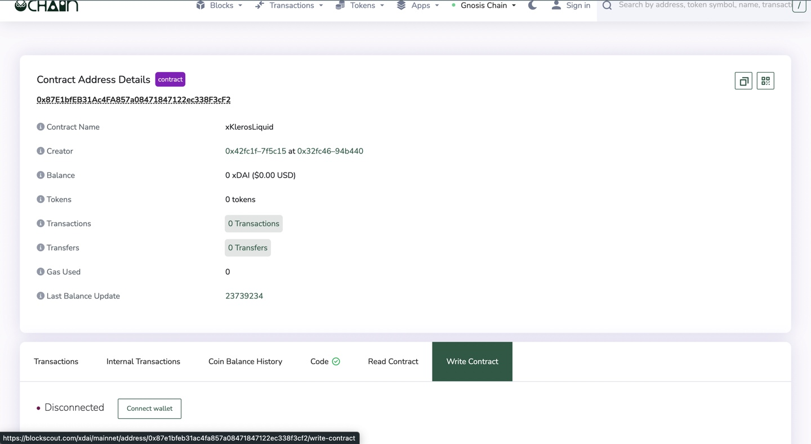
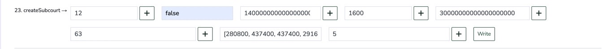
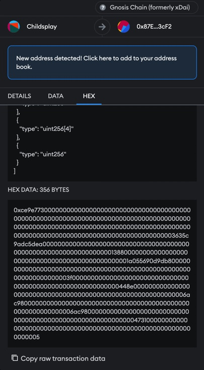
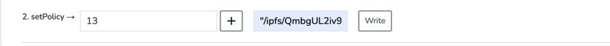

# Guide for Preparing Transactions

### How To: createSubcourt

* When a request comes in to create a new subcourt, start by checking the final Snapshot voting results to see the parameters of the new court.
  * Example [https://snapshot.org/#/kleros.eth/proposal/0x19f0c1de5af192c1f12350f110abd84b4cd8512fcfdb241aa04e0323d316abab](https://snapshot.org/#/kleros.eth/proposal/0x19f0c1de5af192c1f12350f110abd84b4cd8512fcfdb241aa04e0323d316abab)
* To prepare the transaction itself, head over to the respective block explorer of the court deployment.
  * See links to contract deployments here [deployment-addresses.md](deployment-addresses.md "mention")
* Then connect your wallet and navigate to the write contract section of the block explorer.

<figure><figcaption></figcaption></figure>

* Fill in the parameters of the createSubcourt function like so 👇

<figure><figcaption></figcaption></figure>

* Before writing to the contract, make sure your wallet is connected to the network of the deployment you’re trying to write to. In the example above, we’ll need to be connected to Gnosis Chain.

**Note:** It’s best practice to take a screenshot of the input parameters so that whoever executes the transaction can double check.

* Click on Write and navigate to the hex section on your wallet. From there, copy the raw transaction data and paste it somewhere safe.

<figure><figcaption></figcaption></figure>

### How To: PolicyRegistry

* The first step of preparing a PolicyRegistry transaction is writing and pinning the policy JSON. To make this easy, we use the file-to-ipfs package.

```shell
mkdir policy
//
cd policy
//
yarn init -y
//
npm i @kleros/file-to-ipfs
```

* Create a json file and write the policy according to what was specified in the snapshot   proposal.

```json
{
    "name": "xDai Solidity Court",
    "description": "**Court purpose** \n\n If the disputed code is of significant size (> 500 code lines), parties in the dispute should point out specific parts of the content which are being disputed. Otherwise, jurors should refuse to arbitrate.",
    "summary": "",
    "requiredSkills": "This court requires a good level of solidity. Jurors who are not solidity intermediate developers are advised to stake into this court only if they also know how to make relatively simple contracts, know the main solidity hacks and can compute the complexity of simple functions."
}
```

* In the index.js file, run the following script to pin whichever policies you’ve written.

```javascript
const ftIpfs = require("@kleros/file-to-ipfs");

async function pinSol() {
    const solPath = await ftIpfs("./files/xDai-Solidity-Court-Policy.json");
    console.log(`Solidity Court: ${solPath}`);
}

async function pinJs() {
    const jsPath = await ftIpfs("./files/xDai-Javascript-Court-Policy.json");
    console.log(`Javascript Court: ${jsPath}`);
}

async function pinDev() {
    const devPath = await ftIpfs("./files/xDai-Development-Court-Policy.json");
    console.log(`Development Court: ${devPath}`);
}

async function main() {
    pinSol();
    pinJs();
    pinDev();
}

main();

/* Output
Development Court: /ipfs/QmbgUL2iv9XH3jui7xdLBXp2Hqe4VqGnNkK7PnAorJ8XQa/xDai-Development-Court-Policy.json
Solidity Court: /ipfs/QmQbyk1qnD4e4MQrwSr6a21w2t82YJEMxU3F7QTYKkxuNS/xDai-Solidity-Court-Policy.json
Javascript Court: /ipfs/Qme15AUfpvLX3iwEtqswe26PQHMmKnF4eWGywBPqbkdqcD/xDai-Javascript-Court-Policy.json
*/
```

* Copy + Paste the output somewhere safe before closing terminal.
* Go to the PolicyRegistry deployment [deployment-addresses.md](deployment-addresses.md "mention")
* Write the inputs into the setPolicy function (subcourtID and URI string).

<figure><figcaption></figcaption></figure>

* Follow the same steps outlined in the createSubcourt guide to get the raw transaction data.

### Presenting Transactions:

* Make a copy of this [template](https://docs.google.com/document/d/1av-IU5aKwRFzKhktdVNAlkt12sozows6uBapj1T-lq8/edit?usp=sharing) and fill in the necessary information.
* If submitting through **Discord** tag @xpriment626 and share the link to your doc.
* If submitting through **Telegram** tag @clesaege and share the link to your doc.
* If submitting through **Slack** share the link to your doc on the public #dev channel.
