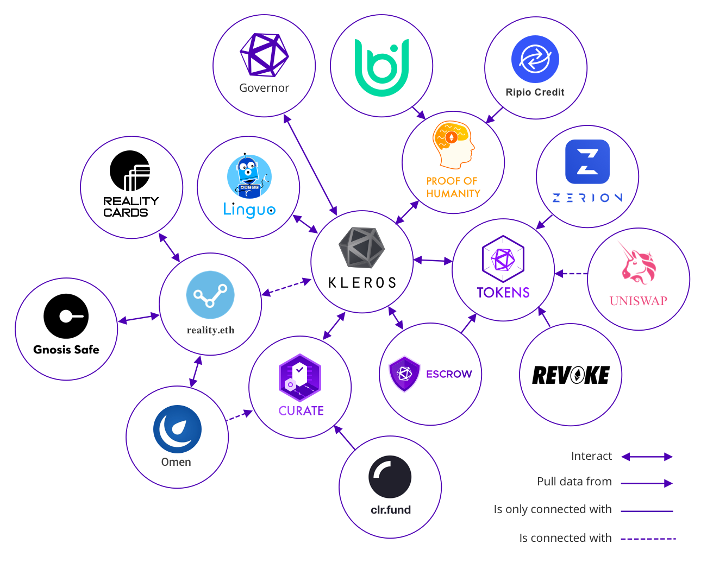
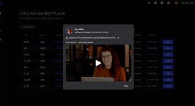

# Live & Upcoming Integrations

The Kleros ecosystem lives and breathes through the disputes brought back to the Court by all arbitrable apps integrated with it. Some are developed by the Cooperative Kleros team \(cf. Products sections\) but most are external projects plugging into the Kleros products to get arbitration/curation/oracle/escrow services.

## Live Integrations

### Omen

The [Omen](https://omen.eth.link/) prediction market \(on Ethereum mainnet and xDai\):

* uses the [Kleros Oracle](https://kleros.gitbook.io/docs/products/oracle) solution \(Reality.eth \(bond escalation\) + Kleros Court \(Arbitration\)\) to rule on the outcome of events that are being predicted in their markets. For example, Kleros jurors rules on famous disputes about the number of Covid deaths in the US in July 2020 \([Case 302](https://thedailychain.com/an-important-case-for-the-decentralized-world-with-kleros/)\) and about the winner of 2020 US presidential election \([Case 532](https://twitter.com/jimmyragosa/status/1341293611682553856?lang=en)\)
* uses a [Kleros Curate](https://curate.kleros.io/tcr/0xb72103eE8819F2480c25d306eEAb7c3382fBA612) list to curate "Verified Markets" that are well written according to acceptance criteria and to display a "Verified" badge next to them on their UI. It allows users to easily be reassured that they are not participating in a "tricky" market designed to fool the outcome shares buyers.

### Gnosis Safe SafeSnap

The [Gnosis Safe](https://gnosis-safe.io/) multi-sig wallet can be used for DAO governance purposes thanks to the [SafeSnap](https://blog.gnosis.pm/introducing-safesnap-the-first-in-a-decentralized-governance-tool-suite-for-the-gnosis-safe-ea67eb95c34f) module. This module is using the [Kleros Oracle](https://kleros.gitbook.io/docs/products/oracle) solution \(Reality.eth \(bond escalation\) + Kleros Court \(Arbitration\)\) to effectively enforce on-chain the implementation and triggering of the proposals voted on by the DAO on Snapshot.

### CLR.fund

The [clr.fund](https://clr.fund/) public goods funding protocol uses a [Kleros Curate](https://curate.kleros.io/tcr/0x2E3B10aBf091cdc53cC892A50daBDb432e220398) list to curate public goods projects that are eligible to receive donations through quadratic funding. It enables the open and fair filtering of non-public goods projects that would diminish the matching of donations for compliant projects.

### Uniswap / Sushiswap

Both [Uniswap](https://uniswap.org/) and [Sushiswap](https://sushi.com/) decentralized exchanges use [Kleros Tokens](https://tokens.kleros.io/tokens) as one of their token lists to be selected to trade on their UIs. This [token list](https://tokenlists.org/token-list?url=t2crtokens.eth) is the only one to be completely open, decentralized, and managed by the community.

### Zerion

Zerion DeFi portfolio management tool pulls data from Kleros Tokens to read the tokens held in your wallet and also uses it as a way to verify the correctness information about tokens displayed in its interface \(if a token is in at least 2 lists _\[ex: Kleros + Coingecko\]_, it earns a "Verified" badge.\)

### Ripio Credit Network

[RCN](https://ripiocredit.network/) is an open-source global credit network that connects lenders, borrowers, and loan originators on the blockchain to create frictionless, transparent, and borderless debt markets. It uses the Proof of Humanity registry to certify that borrowers/lenders are humans and improve trust.

### Reality Cards

[Reality Cards](https://realitycards.io/) is a unique hybrid of prediction markets and NFT art using the [Kleros Oracle](https://kleros.gitbook.io/docs/products/oracle) solution \(Reality.eth \(bond escalation\) + Kleros Court \(Arbitration\)\) to rule on the outcome of events that are being predicted in their markets.

### Universal Basic Income token \(UBI\)

[UBI](https://blog.kleros.io/introducing-ubi-universal-basic-income-for-humans/) is a token built on top of the Proof of Humanity registry and that is streamed directly to an Ethereum address as long as it gets verified as a human in the Proof of Humanity registry and starts the accrual process, establishing a fair and ongoing distribution model. It provides universal access to liquidity that serves to inhibit financial coercion of public decisions and is tradeable in all open markets

### Revoke.cash

[Revoke.cash](https://kleros.gitbook.io/docs/products/tokens) is a tool allowing users to revoke ERC-20 allowances granted from their address to avoid malicious use of these allowances. It uses [Kleros Tokens](https://kleros.gitbook.io/docs/products/tokens) to identify tokens in the wallet connected.

## Integrations \#ComingSoon

* **API3:** Dispute resolution for data feed insurance
* **Union Protocol:** Dispute resolution for claims
* **Gnosis Auctions:** Curation of IDOs
* **Winding Tree:** Dispute resolution for marketplace
* **Gitcoin Grants:** Proof of Humanity for Sybil resistance \(+ ???\)
* **Octo.fi:** Decentralized Listing process
* **MakerDAO:** First prototype of curated registries for token onboarding legal models and real-world asset listing on MakerDAO in the scope of Maker&lt;&gt;Kleros fellowship
* 2 soon-to-be-announced DeFi Insurance projects for Claims arbitration projects.
* Unannounced marketplace platform/

