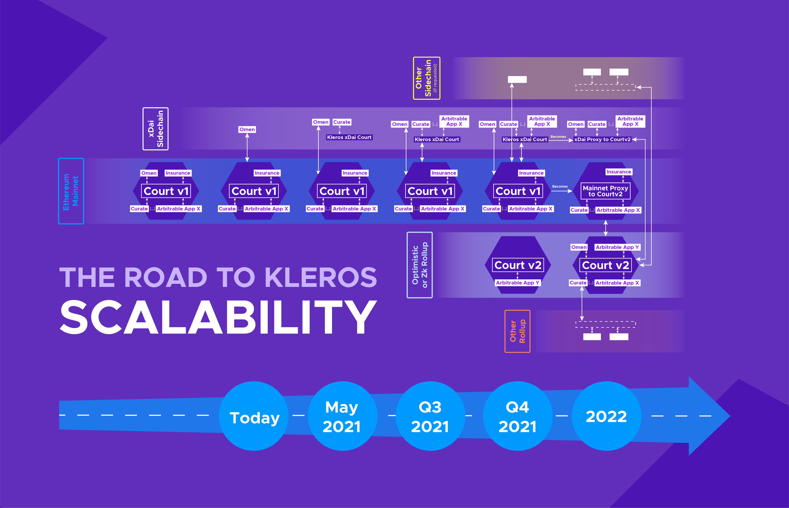

# Scalability & Cross-chain

## **⚖️ THE ROAD TO KLEROS SCALABILITY ⚖️**

Let us navigate together the few steps the Kleros Court will go through to transition from being the go-to Ethereum arbitration protocol to becoming a fully-fledged, scalable, and interoperable Justice system for the crypto world.

* **CURRENT SITUATION**\
  \*\*\*\*Kleros Court is deployed on Ethereum mainnet and mainly rules on disputes for Dapps hosted on the same blockchain (except for the bridge/proxy system for xDai Omen arbitration). Disputes are medium to high-value cases fit for Ethereum limited bandwidth.\

* **MAY-JUNE 2021**\
  \*\*\*\*A dedicated “xDai Kleros Court” is deployed on the xDAI chain to enable data curation and other small to medium value use cases to benefit from Kleros arbitration services. \\
* **EARLY Q3 2021**\
  \*\*\*\*As more and more xDai Dapps uses Kleros dispute resolutions, cases can be appealed until they are ruled on the main Kleros Court on mainnet, improving security. The same system can be deployed to other side chains / commit chains such as Polygon.\\
* **Q3/Q4 2021**\
  \*\*\*\*Kleros Court V2 and its new features (to be revealed soon) are deployed on a ZK or Optimistic rollup (we are still testing both layer 2 solutions). It can natively rule on disputes on the same rollup while bridges and proxies to other chains / L2s are developed.\\
* **2022**\
  \*\*\*\*Kleros Court V2 on a rollup becomes the main hub for all disputes and the secure backstop for all cases. Dapps and Defi products on ETH1, all sidechains, other rollups and EVM chains are safely transported to Kleros Court V2 through proxy contracts.\\

**Kleros becomes the scalable dispute resolution protocol for the multi-chain ecosystem.**\\

🔎 [Our latest thoughts and investigations about Kleros Scalability](https://blog.kleros.io/ethereum-scalability-and-kleros/) 🔎


[xdai.md](xdai.md)

