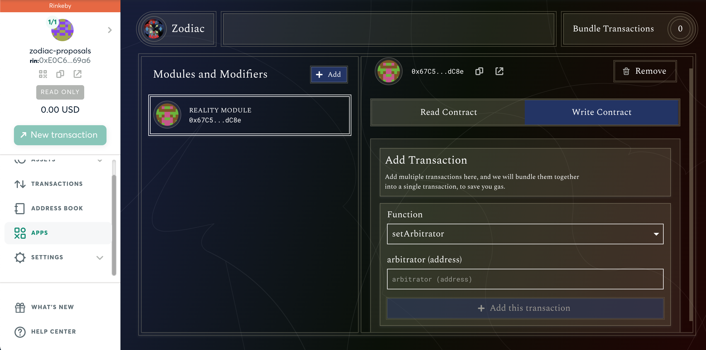

# Safe Zodiac integration

This is a tutorial following a previous governance [blogpost](https://blog.kleros.io/kleros-x-safesnap/) and inspired by the [separation of powers in DAOs](https://www.youtube.com/watch?v=HDSZsl1Zk4c) talk given by Jimmy Ragosa at the ETHCC4. Here, you will learn how to make your DAO fully decentralized using:

* [Gnosis Safe](https://gnosis-safe.io/): one of the leading multi-signature wallets used by companies to manage their crypto assets.
* [Snapshot](https://snapshot.org/#/): a platform widely used for off-chain vote signaling.
* [Zodiac](https://gnosis.github.io/zodiac/docs/tutorial-module-reality/get-started/): a Gnosis Safe module that allows trustless on-chain execution of off-chain votes using [Realitio](https://reality.eth.link/) (an escalation-game-based oracle).
* [Kleros](https://kleros.io/): the decentralized dispute resolution protocol and the final piece of this governance system puzzle, as it secures the Realitio outcome.

## Motivation

You might be wondering why do we need so many blocks to achieve decentralized governance. Let's imagine that your project's treasury and smart contracts are managed by a multisig owned by team members. Furthermore, its token holders can use the project's Snapshot space to vote proposals, which should be carried out if successful, technically feasible and aligned with the project's mission. The big question is how do token holders make sure that the multisig owners will act accordingly.

We can interpret this as a power play between an executive team performing actions and a legislative branch voting about what actions should be taken. The missing piece is a process secured by the equivalent to the judiciary power, which enforces the token holders decisions on-chain. Here is where Zodiac and Kleros come in.

## Getting started

_If your DAO is already using Snapshot, Zodiac and Safesnap but without any arbitrator to resolve disputes, jump to_ [_Adding Kleros to an Existing DAO_](zodiac-integration.md#just-use-kleros)_._

Before starting to integrate Zodiac and Kleros, you will need a Gnosis Safe (learn more about it [here](https://gnosis-safe.io/#getting-started)) and an ENS domain, which must refer to your DAO's Snapshot space. For testing purposes, the [Safe App on rinkeby](https://rinkeby.gnosis-safe.io/) and any ENS name can be used.

In short, Zodiac allows anyone to propose on-chain transactions that will be executed by the DAO. Whether each batch of transactions gets executed or not depends on the Realitio's outcome, based on the DAO's proposal rules. Everyone can participate in Realitio by providing an answer with a bond in ETH or in the DAO's token and request arbitration for disputed proposals.

## Zodiac Setup and Safesnap Integration

A detailed guide on Zodiac setup can be found [here](https://gnosis.github.io/zodiac/docs/tutorial-module-reality/get-started). When setting the parameters, make sure to select Kleros in the arbitrator field. If no arbitrator is set, Realitio will resolve disputed proposals in favor of the highest bond submitted instead of using a third party dispute resolution protocol like Kleros. Alternatively to the Zodiac documentation, you can follow this video tutorial to set up the module.

Once Zodiac is set up and [the Safesnap plugin was added to Snapshot](https://gnosis.github.io/zodiac/docs/tutorial-module-reality/integrate-snapshot), you can start testing proposals. Check also the following video guide on how to create executable proposals and process them after voting has ended:

## Adding Kleros to an Existing DAO 

If your DAO is already using Zodiac but no arbitrator has been set yet, you can do that as follows. Go to the Zodiac module on the Gnosis UI

Go to your module and under the "Write Contract" tab, select the setArbitrator function from the dropdown and, in the arbitrator field, paste the address of the Realitio Arbitration Proxy contract (Ethereum Mainnet: 0xf72CfD1B34a91A64f9A98537fe63FBaB7530AdcA). This proxy supports the Realitio interface and adds some features to the arbitration process, for example, allowing appeals to be crowdfunded.

Once executed, Kleros is integrated into your DAO governance. Make sure to have governance guidelines written down and available, either at the DAO's ENS or somewhere clearly visible to the DAO (for an example check the [Proof of Humanity governance process](https://gov.proofofhumanity.id/t/hip-5-adopt-a-proper-poh-dao-governance-process-to-ensure-hip-quality/393)).

## Removing Gnosis Safe Signers 

There is one final thing we need to do to make the DAO truly decentralized.

The Safe signers still have control over the multisig and some privileges over the SafeSnap module (like changing the arbitrator, question timeout, etc.). Let's remove those. Go to "Settings" --> "Owners" and remove all signers of the multisig except for yourself. It's not possible to have an ownerless Safe. For this reason, the remaining owner (you) has to be replaced by the Zodiac module address.

Once this is done, it will be only possible to interact with the DAO's Safe through the Zodiac module, i.e. via governance.

## More About Kleros

There are some important reasons why your governance system should be using Kleros as arbitrator.

First off, a good arbitrator should be hard to attack. At the time of writing, Kleros courts have 150M PNK (\~4M USD) of stakes and roughly 800 active jurors. A substantial input of money over a sustained period of time would have to be invested to bend a court decision and, even if someone achieves to do so, it would probably be at a huge loss. For an in depth read go to [Why Kleros Need a Native Token](https://medium.com/kleros/why-kleros-needs-a-native-token-5c6c6e39cdfe).

In addition, since conception, Kleros courts have resolved over 1000 cases of wide variety. Check the [Famous Kleros Cases](https://kleros.gitbook.io/docs/products/court/famous-kleros-cases) to see some examples. Kleros courts are active and have built a strong reputation.

A good arbitrator should also be consistent over time, building jurisprudence as disputes get resolved while paying close attention to evidence and policy. This has especially been seen in the [Tokens registry](https://tokens.kleros.io/tokens) and [Proof of Humanity](https://app.proofofhumanity.id/).

The Kleros Court is currently used as the Judiciary branch of [the Kleros DAO, the Proof of Humanity DAO and the UBI DAO](https://governor.kleros.io/). Even though these DAO's use a different infrastructure that depends on the Kleros Governor, this is a good precedent of a well functioning decentralized governance system.
