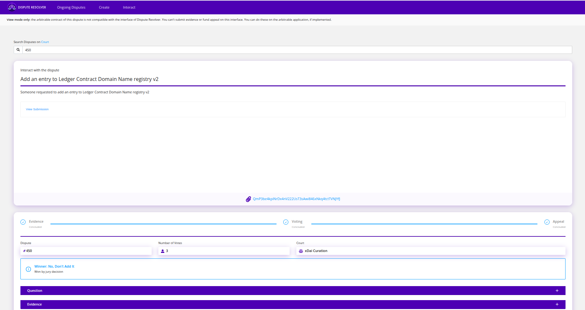

# Dispute Resolver

🔨 [Dispute Resolver](https://resolve.kleros.io/) 🔨

Kleros Dispute Resolver allows users to create, manage, and interact with disputes on the Kleros protocol. It provides a user-friendly interface for creating custom disputes, submitting evidence, funding appeals, and following the progress of disputes through the arbitration process.

It allows users to:

* Create disputes by filling out a form
* List and view open disputes
* See dispute details
* Submit evidence
* Fund appeals
* Track dispute progress

The application serves as a bridge between users and the Kleros Court system, allowing for decentralized arbitration without requiring users to write their own smart contracts.

### When to Use Dispute Resolver

You should consider using Kleros Dispute Resolver in the following scenarios:

1. **Need for Neutral Arbitration**: When you need a neutral third party to resolve a dispute.
2. **Standalone Disputes**: When you want to create a dispute without integrating with an existing dApp or application.
3. **Off-chain Disputes**: For disputes involving off-chain activities that cannot be trustlessly integrated with Kleros.
4. **Cross-chain Arbitration**: When Kleros Court is not yet available on your specific blockchain/L2.
5. **Limited Resources**: When you lack the resources for a full smart contract integration.
6. **Custom Arbitrable Contracts**: For protocols with a custom arbitrable contract which don't have their own frontend to submit evidence or fund appeals. If the arbitrable contract implements the IDisputeResolver interface (available as an [NPM package](https://www.npmjs.com/package/@kleros/dispute-resolver-interface-contract)), it can take advantage of the Dispute Resolver frontend.

### Main Features

<figure><figcaption></figcaption></figure>

#### 1. Ongoing Disputes

View all active disputes currently in progress within the system. This section allows you to browse disputes based on different phases:

* Evidence submission
* Commit phase
* Voting phase
* Appeal phase

#### 2. Create Dispute

The application provides a user-friendly form to create custom disputes. You can:

* Select a specialized Kleros court
* Choose the number of jurors
* Define the dispute title, description, and category
* Specify the question type (multiple choice, numeric, date)
* Set ruling options
* Add party information (aliases and addresses)
* Upload supporting documentation

<figure><figcaption></figcaption></figure>

#### 3. Interact

This section allows users to:

* View detailed information about specific disputes
* Submit evidence to ongoing disputes
* Fund appeals for disputes in the appeal phase
* Withdraw rewards after disputes are resolved

<figure><figcaption></figcaption></figure>

### Using the Application

#### Connecting Your Wallet

To interact with Dispute Resolver, you need to:

1. Have a Web3-compatible wallet (like MetaMask) installed
2. Connect your wallet to the application
3. Ensure you have sufficient funds for dispute creation and appeal funding

#### Viewing Ongoing Disputes

1. Navigate to the "Ongoing Disputes" tab
2. Browse the list of active disputes
3. Filter disputes by their current phase if necessary
4. Click on a dispute to view more details

<figure><figcaption>
A sample Dispute 
</figcaption></figure>

#### Creating a New Dispute

1. Navigate to the "Create" tab
2. Fill out the dispute creation form:
   * Select the appropriate court for your dispute
   * Specify the number of jurors (more jurors = higher cost but potentially more thorough arbitration)
   * Enter a title and description for the dispute
   * Select the question type (this determines how jurors will vote)
   * Enter the specific question to be resolved
   * Define the ruling options
   * Add party information if relevant
   * Upload any primary documentation (up to 4MB)
3. Review the arbitration cost displayed
4. Submit the form to create the dispute\

<figure><figcaption>
A sample dispute for Klers Solidity court
</figcaption></figure>

**Question Types:**

* **Multiple choice: single select**: Standard question with multiple options where jurors select one answer
* **Multiple choice: multiple select**: Question where jurors can select multiple options
* **Non-negative number**: Asks for a numerical answer (≥ 0)
* **Date**: Asks for a date as an answer

**Interacting with Existing Disputes**

1. Navigate to the "Interact" tab or click on a specific dispute
2. Review the dispute timeline showing its current phase
3. Explore the accordion sections for:
   * Appeal information
   * Question details
   * Evidence timeline\

<figure><figcaption>
Interact with the sample dispute 
</figcaption></figure>

#### Submitting Evidence

1. Open the dispute details page
2. Navigate to the "Evidence" section (available only during the Evidence phase)
3. Click to submit new evidence
4. Enter a title and description for your evidence
5. Upload supporting files if necessary
6. Specify which side your evidence supports
7. Submit the evidence

<figure><figcaption></figcaption></figure>

<figure><figcaption></figcaption></figure>

#### Funding Appeals

1. Open the dispute details page
2. Navigate to the "Appeal" section (available only during the appeal phase)
3. Choose which ruling option you want to support
4. View funding progress, suggested contribution, and potential return on investment
5. Enter the amount you wish to contribute
6. Confirm the transaction

When a ruling is appealed:

* Both sides (winner and loser) need to provide funds
* If only one side is fully funded, that side wins by default
* If both sides are fully funded, the case goes to a new round with more jurors

### [Recognition of Jurisdiction (RoJ) Setup](../use-cases/1.-dispute-resolution-integration-plan/)

For cases where the dispute ruling is not enforced onchain, you can use a Recognition-of-Jurisdiction (RoJ) setup:

1. Create standalone disputes on resolve.kleros.io
2. Your service/platform pledges to enforce Kleros rulings
3. Share the dispute link with relevant parties

This approach allows you to:

* Quickly introduce Kleros arbitration into your process
* Test the system before investing in development
* Handle off-chain disputes that cannot be trustlessly integrated

### For Developers with Custom Arbitrable Contracts

If you have developed a custom arbitrable contract and need a user interface for your users to interact with disputes:

1. Implement the IDisputeResolver interface in your arbitrable contract (available as an [NPM package](https://www.npmjs.com/package/@kleros/dispute-resolver-interface-contract))
2. The Dispute Resolver application will then be fully compatible with your contract
3. Users can use Dispute Resolver to submit evidence and fund appeals for disputes created through your contract
4. This eliminates the need to build your own dispute management frontend

The `IDisputeResolver` interface standardizes crowdfunded appeals and evidence submission, making it easier to integrate with the Kleros ecosystem.
