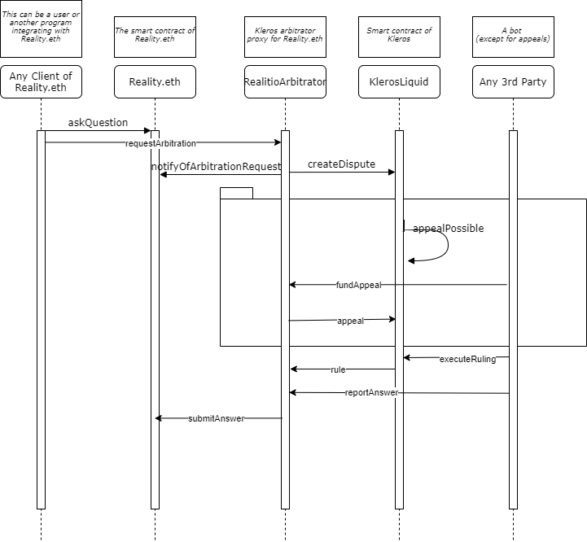

# How to use Reality.eth + Kleros as an oracle

In use cases where a subjective oracle is required to give an answer on-chain about the occurrence of an event \(e.g.: Prediction Markets, DAO Governance, etc...\), your application might want to use the combination of [Reality.eth](https://reality.eth.link/) bond escalation mechanism with Kleros arbitration services to have a decentralized and fair source of truth.

[Learn more about this use case](https://kleros.gitbook.io/docs/products/oracle)

### Architecture


* **Your app requiring a subjective oracle**

  This is your smart contract that will only interact directly with Reality.eth contract.

* **Reality.eth**

  Bond escalation mechanism contract where anyone can submit a question with a required minimum bond to submit answers. It is possible to request arbitration by a 3rd party at any point after a first answer is submitted.

  [Documentation](https://reality.eth.link/app/docs/html) - [Github](https://github.com/realitio/realitio-contracts/tree/master/truffle/contracts)

* **Reality.eth &lt; &gt; Kleros Arbitrator proxy**

  Contract acting as a proxy between Reality.eth and Kleros Court contract. It acts as a Reality.eth arbitrator by creating corresponding disputes in Kleros Courts and submitting the final ruling as an answer in the proper format. This contract is configured with a number of initial votes required and a specific sub-court where the dispute will be raised \(ex: 5 initial votes by jurors in Blockchain &gt; Technical court\). You can use one already used by other apps or ask the cooperative Kleros team to deploy a new one fit for your needs.

  [Github](https://github.com/kleros/realitio-arbitrator-with-appeals)

* **Kleros**

  [Kleros Court](https://kleros.gitbook.io/docs/products/court) contract that will adjudicate on the dispute by drawing jurors and publishing a final ruling about the case.

### Requirements

To use this service, you just need to ensure that:

* your smart contract is compatible with the Reality.eth contract interface \(check their [documentation](https://reality.eth.link/app/docs/html/contracts.html) and [repo](https://github.com/realitio/realitio-contracts/tree/master/truffle/contracts)\)

  * If your contract is in development, Cooperative Kleros team can support you in making it compatible.
  * If your contract is already live, Cooperative Kleros team can support you in building a connector for it.

* you submit the address of the Reality.eth&lt;&gt;Kleros arbitrator proxy you want to use as `arbitrator`when you ask a question

```typescript
function askQuestion ( uint256 template_id, string question, address arbitrator, uint32 timeout, uint32 opening_ts, uint256 nonce ) external payable returns ( bytes32 );
```


**Reality.eth &lt;&gt; Kleros Arbitrator Proxy deployments**

* \(Current version\) Mainnet - to be deployed soon
* \(Current version\) [Kovan](https://kovan.etherscan.io/address/0xDEd12537dA82C1019b3CA1714A5d58B7c5c19A04)
* ~~\(Old version without appeals\)~~ [~~Mainnet~~](https://etherscan.io/address/0xd47f72a2d1d0E91b0Ec5e5f5d02B2dc26d00A14D)~~~~
  * ~~500 votes in general Court~~
* ~~\(Old version without appeals\)~~  [~~Kovan~~](https://kovan.etherscan.io/address/0xa6ead513d05347138184324392d8ceb24c116118)~~~~


### Sequence Diagram



