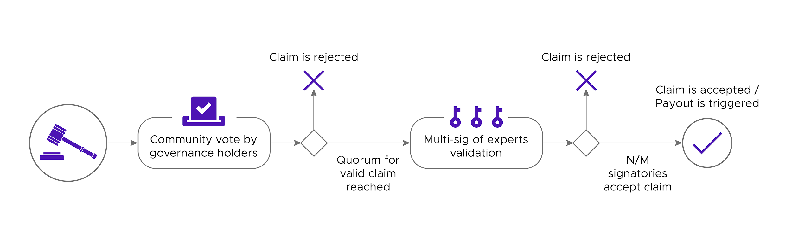

# DeFi Insurance 

## An overview

DeFi Insurance has been one of the fastest-growing sectors of DeFi in the last couple of years and will continue to be one of the sectors with the most growth potential in the coming few years. While DeFi brings with it permissionless access, decreased centralization and increased transparency, it introduces a new set of risks that traditional Centralized Finance do not have. This includes - but are not limited to - smart contract risks, stablecoin depegs, oracle exploits and other market risks linked to the extreme price volatility of cryto-assets. 

While these risks never be entirely eliminated, they can be insured against, and it is expected that insurance solutions will come to play an increasingly important role in solidifying user trust in DeFi.

Various decentralized projects have risen to fulfil this much needed service. This is however no easy feat to pull off, and it is commonly believed that the most critical parts of these projects such as claim approval still needs to run on a centralized model. Kleros however believes that decentralization is possible. In this article, we will explore the benefits and detriments of the most common claim systems deployed currently, as well as what Kleros can bring to the table to improve them.

## Key processes to decentralize in DeFi Insurance

There are two key areas of DeFi Insurance that are challenging to decentralize: the listing of custodians and DeFi projects that covered under the insurance, and claim management.

### Claim Management
An insurance claim is a formal request by a user to an insurance product for coverage or compensation for a covered loss or policy event. In the case of a decentralized finance insurance organization, a designated authority (DAO, Multi-sig, Dispute Resolution, Centralized Resolver,...) should validate this claim (or deny it). If it is approved, the insurance contract will issue payment to the insured or an approved interested party on behalf of the insured.

_Insurance governance token holder that will see the value of its holdings decrease in case of a hack payout: “I don’t see any damage/hack here, sir.”_

Legacy insurance companies often handle claims in a non-transparent and indisputable manner. The challenge for new DeFi Insurance products (apart from offering coverage for investments that could not be covered anywhere else) is therefore to offer a trust-minimized, editable and fair mechanism to manage and arbitrate claims.

### Listing of coverage

In order to provide transparency and clarity to the claim process, it's important for insurance services to explicitly state the scope of their coverage, and if possible, the specific DeFi protocols that are supported under the coverage. 

Reviewing the soundness and security of each of these protocols and assigning risk parameters to each one of them is a time-consuming and expertise-intensive process that requires assessors with both substantial technical and financial knowledge, and attempting to do this in a decentralized and permissionless manner is a feat that has not been achieved so far.

## The pitfalls of managing claim management and coverage listing through DAO governance

The solution most often used by DeFi insurance projects is to delegate the challenges above to their DAO governance. While it might seem intuitively like a great solution, it is often fraught with dangers and pitfalls.

Most DeFi insurance projects out there are employing a multi-step voting process to manage their claims and these votes use the native governance token of the project as a ballot. The claims will first often go through a community-wide approval or rejection process before being reviewed by a final committee that acts as the final decision-maker.

A comprehensive ruling is always more welcome than a fast one if the reputation of the insurance app is to be preserved. This is challenging in practice: the final committee validation is often justified by the need to have a quick turnaround for payouts, but the past has taught us that it can take days for some complex DeFi hacks to be fully understood.

This multi-step process, without an option to challenge claims, seems like a straightforward way to go to both handle the auditing of claims and attempt to give additional utility to the token but it presents several weaknesses and risks:

* **Overridden Community Vote**\
  The fact that the first round of vote by the governance token holders can be overridden every time by a committee of a handful of experts without a possibility to challenge them can make the whole process look like decentralization theater.
* **Community-wide Vote Fatigue**\
  If an insurance project uses its native governance token to have every token holder vote on every claim ever raised, it will require a massive duplication of effort and might be plagued by low response rates progressively creating security issues in the form of claim validation vote that could easily be swayed by a single whale.
  If voting is made optional, the results could skew towards the goals of those with specific agendas that may not be in the interest of the community, opening the door for collusion or vote buying.
* **Risk of creating a weaker single-use court system**\
  If a DeFi protection app recreates a system where a few randomly selected token holders vote, then they will basically have to recreate a version of a dedicated arbitration system such as Kleros Courts - except that if it is the only utility of their token, then it won't benefit from network effects that Kleros has, where combining a lot of use cases together gives the token enough value to resist 51% attacks. Moreover, If they tack Kleros-like features onto a token that does something else/has value for some other reason, they will not have any guarantee that the culture around their token will develop appropriately so that people reliably stake so that their court can have good resistance to those same 51% attacks.

Some other DeFi protection initiatives will let the users directly choose which arbitrator they want for the protection contracts they just created. And finally, the rest will be based on an automated incident monitoring system keeping an eye on events that can be detected and published on-chain (like a MakerDAO emergency shutdown or a stablecoin on-chain price feed going below a specific value).

# Why Kleros is a better solution

Kleros offers better decentralized solutions to the challenges mentioned above, which are explained in this section.

## Kleros as a fair and trustless Claim Arbitration System

Kleros recommends a Claimant-Challenger model for decentralizing your claim management process: a solution that can be achieved using Kleros's [Dispute Resolver](https://resolve.kleros.io/), which allows claims and disputes from an insurance protocol to be passed on to the Kleros Courts for arbitration. 

An arbitrable Claim Management contract can be written to interface between the Kleros Courts and the insurance protocol's payout contracts, allowing the decisions of the jurors in the Kleros Courts to translate to decision on claims within a DeFi insurance protocol. 

The Claimant-Challenger model follows the standard request-challenge protocol with a crowdfunded appeal system, where the claim submitter registers the claim and anyone can challenge said claim, thus creating a dispute in Kleros Court. An insuree would then be able to submit a claim using that contract and to provide the information related to his claim. If their claim is challenged, a dispute will be opened in the relevant Kleros Court. If not challenged, the claim will be considered valid and a payout will be triggered. An illustration of this process can be seen below:

The Claim Management contract also can be designed to go beyond just simple Approve/Reject decisions, incorporating functionalities such as the ability for counter-offers to claims to be raised by parties such as the DAO governance or designated claim oversight teams.

By doing this, an insurance project will simplify its development efforts by focusing on just the insurance mechanisms, while outsourcing the arbitration process to a decentralized and uncorrelated system.

In summary, in the case of claim systems using Kleros as Claims arbitrator, the final ruling will be made if:
* no claim challenge has been raised
* no appeal has been made after a previous decision by jurors 
* a decision has been made in the highest General Court with no more appeal possible.

### Incremental adoption of Kleros

There are many ways to incorporate Kleros into your DeFi insurance protocol, and it is possible to only adopt the elements that add the most benefit now, and incrementally move towards a more comprehensive integration when the need arises. 

There are 4 levels at which Kleros can intervene in a claims process:

1. As the single default source for ruling after a claim is challenged,
2. As one of the arbitration systems that can be selected when deploying a coverage contract,
3. As a ruler of last resort if a challenger is able to gather a sufficient claim challenge deposit at the end of a native claims process
4. As one of the signatories in a multi-sig committee taking the final decision about a claim.

Another possibility would be for insurance projects to share a single common registry of “official DeFi hacks/exploits” that could be built as a [Kleros Curate](https://kleros.io/curate/) list, and have automatic payouts tied to the acceptance of a new entry into the list.

## Kleros Curate as a decentralized coverage curation system

Kleros Curate can be used to create a Token Curated Registry (TCR) of projects covered under your insurance protocol, drastically scaling the speed and efficiency of the listing of new coverages, as well as increasing the transparency and decentralization of your coverage listing process. 

A custom TCR can be set up for your insurance protocol, with a listing criteria unique to the needs and policies of your protocol. New listings can be submitted by any user, but all submissions will come under the scrutiny of Kleros's juror network in the pre-defined (sub-)Court. The jurors staked in this court will vote and rule on the listings, taking into account both the listing criteria of your unique TCR, as well as the policies of the Court that the dispute takes place in. As the jury is independent of the insurance protocol and incentivised by the economics of the Court to vote honestly, the decision of the Kleros Court offers unmatched levels of neutrality and exhaustiveness in the examination of listing decisions.

### Incremental adoption of Kleros

There are many ways to incorporate Kleros into your DeFi insurance protocol, and it is possible to only adopt the elements that add the most benefit now, and incrementally move towards a more comprehensive integration when the need arises. 

Here are several options for the setup of a coverage listing:
1. Read off one of the public insurance coverage TCRs already created using Kleros Curate
2. Create your own custom listing and accompanying listing criteria using Kleros Curate.

For the incorporation of the listing results into your insurance protocol:
1. Use the Kleros listings as to inform your currently centralised listing process.
2. Use Kleros's listings as a first check, and listing submissions that pass both the Kleros checks and your centralised checks make it to a final listing.
3. Use the Kleros listing as the only source of truth

In conclusion, if you don’t want to reinvent the wheel and expose your project to badly designed dispute resolution incentives, you should [reach out to us](mailto:contact@kleros.io) to seamlessly integrate the Kleros dispute resolution protocol within your Insurance project.\