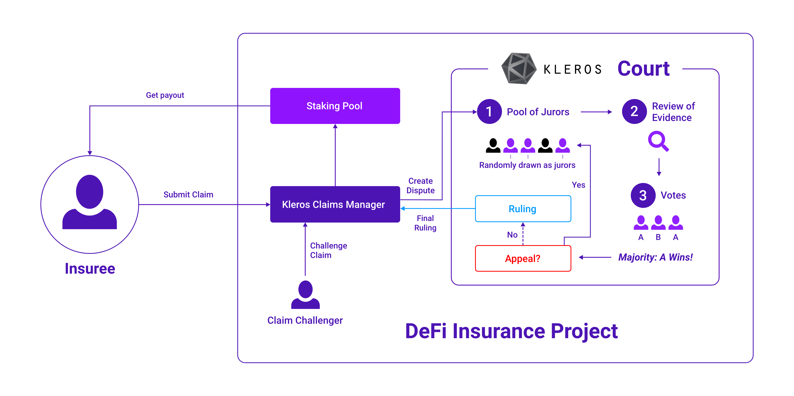

# DeFi Insurance

DeFi Insurance has been one of the fastest-growing sectors of Decentralized Finance in 2020 and it is still one of those that offer the most growth potential in the next few years, as it is tightly linked with the rise of the total value locked in DeFi contracts and the quest for safety for institutions joining the space. One of the main drivers behind the development of multiple DeFi insurance protocols these last few months is the fact that crypto investors are looking for peace of mind and want to trust that their crypto-assets are safe in case of a bug or a hack.

However, this promising field relies deeply on the yet unproven assumption that insurance claims can be managed efficiently and fairly without a centralized authority. Let’s explore the benefits and detriments of the most common claim systems deployed currently and what Kleros can bring to the table to improve them.

## Claim Management is at the core of trust-minimization processes for all DeFi Insurance products

An insurance claim is a formal request by a user to an insurance product for coverage or compensation for a covered loss or policy event. In the case of a decentralized finance insurance organization, a designated authority \(DAO, Multi-sig, Dispute Resolution, Centralized Resolver,...\) should validate this claim \(or deny it\). If it is approved, the insurance contract will issue payment to the insured or an approved interested party on behalf of the insured.

_Insurance governance token holder that will see the value of its holdings decrease in case of a hack payout: “I don’t see any damage/hack here, sir.”_

Legacy Insurance companies will often handle claims in a non-transparent and indisputable manner. One of the main differentiators and benefits from the new DeFi Insurance products \(apart from offering coverage for investments that could not be covered anywhere else\) is to offer a trust-minimized, editable and fair mechanism to manage and arbitrate claims.

## The dangers of mixing governance and claim management

Most DeFi insurance projects out there are employing a multi-step voting process to manage their claims and these votes use the native governance token of the project as a ballot. The claims will often go through a first community-wide approval or rejection before being reviewed by a final committee that acts as the final decision-maker.

The final committee validation is often justified by the need to have a quick turnaround for payouts but the past has taught us that some complex DeFi hacks could not be fully understood in a few hours/days and that a comprehensive ruling is always more welcome than a fast one if you want to preserve the reputation of the insurance app.

This multi-step process, without an option to challenge claims, seems like a straightforward way to go to both handle the auditing of claims and attempt to give additional utility to the token but it presents several weaknesses and risks:

* **Overridden Community Vote** The fact that the first round of vote by the governance token holders can be overridden every time by a committee of a handful of experts without a possibility to challenge them can make the whole process look like decentralization theater.
* **Community-wide Vote Fatigue** If an insurance project uses its native governance token to have every token holder vote on every claim ever raised, it will require a massive duplication of effort and might be plagued by low response rates progressively creating security issues in the form of claim validation vote that could easily be swayed by a single whale.
* **Rebuilding a weaker single-use court system** If a DeFi protection app recreates a system where a few randomly selected token holders vote, then they will basically have to recreate a version of a dedicated arbitration system such as Kleros Courts - except that if it is the only utility of their token, then it won't benefit from network effects that Kleros has, where combining a lot of use cases together gives the token enough value to resist 51% attacks. Moreover, If they tack Kleros-like features onto a token that does something else/has value for some other reason, they will not have any guarantee that the culture around their token will develop appropriately so that people reliably stake so that their court can have good resistance to those same 51% attacks.

Some other DeFi protection initiatives will let the users directly choose which arbitrator they want for the protection contracts they just created. And finally, the rest will be based on an automated incident monitoring system keeping an eye on events that can be detected and published on-chain \(like a MakerDAO emergency shutdown or a stablecoin on-chain price feed going below a specific value\).

## Kleros as a fair and trustless Claim Arbitration System

Kleros courts can be easily built into any DeFi holdings coverage set of contracts by integrating an arbitrable Claim management contract that will manage the claim and the challenge process.

By doing this, an insurance project will simplify its development effort by focusing on the insurance mechanisms and ensure the arbitration is handled by a decentralized and uncorrelated system

This contract would follow the standard request-challenge protocol with a crowdfunded appeal system, where the claim submitter registers the claim and anyone can challenge said claim thus creating a dispute in Kleros Court. An insuree would then be able to submit a claim using that contract and to provide the information related to his claim. If their claim is challenged, a dispute will be opened in the relevant Kleros Court. If not challenged, the claim will be considered valid and a payout will be triggered.

To sum up: In the case of claim systems using Kleros as Claims arbitrator, the final ruling will be made if no claim challenge has been raised, if no appeal has been made after a previous decision by jurors or if a decision has been made in the General Court with no more appeal possible.

There are 4 levels at which Kleros can intervene in a claims process \(ranked by added value\):

1. As the single default source for ruling after a claim is challenged,
2. As one of the arbitration systems that can be selected when deploying a coverage contract,
3. As a ruler of last resort if a challenger is able to gather a sufficient claim challenge deposit at the end of a native claims process,
4. As one of the signatories in the multi-sig committee taking the final decision about a claim.

Another possibility would be for insurance projects to share a single common registry of “official DeFi hacks/exploits” that could be built as a [Kleros Curate](https://kleros.io/curate/) list and could trigger an automatic payout each time a new entry is accepted into the list.

In conclusion, if you don’t want to reinvent the wheel and expose your project to badly designed dispute resolution incentives, you should [reach out to us](mailto:contact@kleros.io) to seamlessly integrate the Kleros dispute resolution protocol within your Insurance project.  

