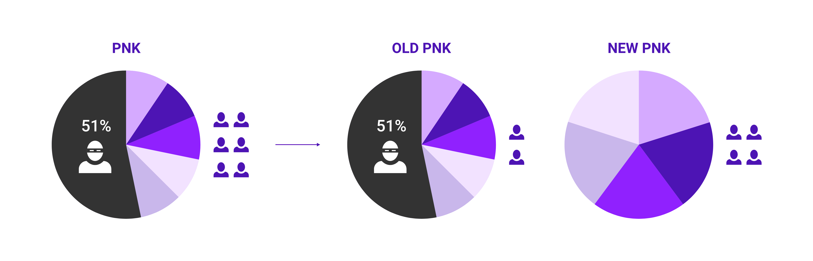

# Kleros FAQ

## General

### Can you really trust a decision made by a bunch of anonymous people on the Internet?

Satoshi Nakamoto taught us that a number of anonymous computers who do not trust each can still reach consensus, provided incentives are correctly structured. Kleros extends this principle to human decision-making. A number of anonymous jurors who do not trust each other can reach consensus on a right decision, provided incentives are correctly structured.&#x20;

Since decisions made in Kleros affect the allocation of resources, there is an incentive for parties to try to bribe or intimidate the tribunal. Pseudonymity is intended to protect jurors from bribing attempts, intimidation, and retaliation. It favors their functional independence (ability to freely give their judgement). It also simplifies the process of users becoming jurors and avoids the costs of identity verification. By providing a secure environment and simplifying the selection process, Kleros greatly enlarges the pool of potential jurors. This results in lower arbitration costs and the democratization of access to justice.

To learn more about the incentive system, read our white paper.

### How long has Kleros been operating?

Kleros Court has been live since 2018 on Ethereum mainnet, and it has handled and ruled on more than a thousand different cases and has a community of more than 760 active jurors staking in 23 different courts (Source: [KlerosBoard](http://klerosboard.com)). Kleros Court has ruled fairly on several controversial cases where millions of dollars were at stake (cf. [Famous Kleros Cases](https://kleros.gitbook.io/docs/products/court/famous-kleros-cases)). It is trusted as an unbiased and transparent arbitration layer by multiple Dapps of the ecosystem in different fields (Prediction Markets, Insurance, DEX, Sybil-Resistance, Marketplaces,... check all those integrations [here](https://kleros.gitbook.io/docs/integrations/live-and-upcoming-integrations)).

### What is the PNK token supply?

The current total supply is 764,626,704 PNK. The supply can only be modified by the Kleros community through a DAO governance vote.

### Does a party who wants to have a case adjudicated need to hold PNK?

No, only jurors will need PNK in order to be drawn. Parties don’t even need to know what the Kleros token is.

### Is the identity of jurors revealed?

Since decisions made in Kleros affect the allocation of resources, there is an incentive for parties to try to bribe or intimidate the tribunal. Anonymity is intended to protect jurors from intimidation and retaliation. It also simplifies the process of users becoming jurors and avoids the costs of identity verification. By providing a secure environment and simplifying the selection process, Kleros greatly enlarges the pool of potential jurors. This results in lower arbitration costs and the democratization of access to justice.

### What is Kleros token allocation?

Team Members: 18% First Round of Token Sale: 16% Airdrop: 4% Subsequent Rounds and Juror Incentive Program: 50% Kleros Cooperative Development Reserve: 12%

### Could Kleros become a platform used by mainstream online retailers such as eBay or Amazon?

Yes, by adopting Kleros, any mainstream e-commerce platform could enjoy a fast, affordable, and transparent dispute resolution method. If you want to learn more, watch [t](https://youtu.be/ssdgdV\_fngI)his talk ["When Decentralized Protocols Meet the Real World"](https://youtu.be/ssdgdV\_fngI) or contact us.

### Is Kleros a court where rich people have more rights than ordinary folks (because appeals are more affordable for the rich)? / How can I expect fairness from a court where whales have staked a lot of PNK?

Anyone can appeal a dispute ruling in Kleros. Most of the time both sides will be asked to contribute fees for the next round of voting to ensure jurors are rewarded and that the losing side is reimbursed of its paid fees. This appeal system ensures that the final decision of jurors will always converge to the truth and that jurors in initial rounds of voting vote coherently from the start not to be penalized.

This usually leads to some critics saying that one of the parties with much greater resources than the other can always win a case. We have made a number of design choices regarding the structure of the appeal fee process in order for Kleros to provide just outcomes even in this situation:

1. Appeal fees can be “crowdfunded.” Namely, anyone can contribute a portion of either sides' appeal fees, potentially with many small contributions adding up to cover the whole fee.
2. Crowdfunders who pay part of the fees of the side that ultimately wins are financially rewarded.

People are thus incentivized to look at current appealed cases to spot obvious incorrect rulings and help crowdfund the other side to earn all or part of the rewards. This has been proven effective to deter "rich" parties from trying to win just by appealing several times and it can make them lose a lot of money if they are malicious. Learn more about it [here](https://blog.kleros.io/kleros-decentralized-token-listing-appeal-fees/).

### Can't someone just buy a lot of Kleros tokens and 51% attack the Kleros Court?

In order for a "whale" attacker to flood the juror pool and try to "control the court", they would need to buy enough PNK so that they are selected enough times to be a juror for the same case in order to change the outcome. Generally, this means that the attacks need 51% of the total staked tokens.

An attacker may get lucky in rare circumstances and be selected for two of three juror spots with only a minority of the PNK. However, in order to maintain the attack through the appeal process, it would need to be selected for the majority of the juror spots on larger and larger juries, which will only be possible if the attacker actually has a majority of the PNK. Hence, substantial economic resources in the order of hundreds of millions of dollars would be required to perform a 51% attack.\
\
_**If a "whale" tries to buy 51% of all staked PNK:**_ The PNK market liquidity will dry up. As the attacker buys PNK, it will start to become scarce and each additional PNK will cost more and more. The attacker may not even be able to find 51% of PNK for sale on the open market at any given time and it will progressively cost so much that the attack would not be economically viable.\
\
_**If a malicious attacker did manage somehow to buy a majority of staked PNK:**_ The community would realize that it is under attack, particularly if the attacker uses his new PNK to commit obvious miscarriages of justice. In this case, Kleros would lose credibility as an arbitration platform and the value of PNK would decrease. Then the attacker would take a substantial loss on the PNK she bought, representing a high economic cost to carry out the attack.

_**If a malicious attacker made a successful 51% attack:**_ The community would perform a last-ditch defense by forking the system to remove the attackers’ holdings. Then the market would sort out which version of PNK should be used going forward. This is similar to the [ultimate appeal mechanism of Augur](https://medium.com/kleros/kleros-and-augur-keeping-people-honest-on-ethereum-through-game-theory-56210457649c).

On the left, an attacker has managed a 51% attack and starts carrying out obvious miscarriages of justice. The community decides to fork the token removing the attackers’ holdings, and most of the users migrate to the new version of PNK.\
\
More details [here](https://kleros.gitbook.io/docs/pnk-token).

### How can I follow the dispute resolution process and be sure it has not been tampered with?

Kleros protocol is committed to full transparency. Its cases are completely open and can be monitored by any person with access to an internet connection. The entire history of cases is also available and published on-chain for reference. Kleros dispute resolution procedure is documented in many places. All cryptoeconomic research is public and the code is open source. A fully working version of Kleros could be replicated in a matter of minutes by anyone with technical skills in blockchain.

### Can Kleros go beyond simple binary cases?

Kleros can go beyond simple Yes/No arbitration cases to cover also multiple choices and even numerical/scalar outcomes (e.g. what is the number of electoral college votes won by Biden in the 2020 election?).&#x20;

We normally prescribe offering binary choices to the jury as it avoids the negative effects of vote-splitting, and allows for a small number of jurors (potentially as low as just one) to already arrive at a useful result.

For complex multi-factorial cases, the [Pendulum arbitration](https://en.wikipedia.org/wiki/Pendulum\_arbitration) method can be used to ask the Kleros jury to choose between two (or more sets of outcomes).

## Jurors

### Can appeals be managed outside of Kleros?

Yes, it’s possible to create an arbitrable smart contract that uses Kleros for solving first instance disputes and allows appeals to be handled outside of Kleros.

### Can I use a smart contract account to stake in the court?

Jurors should not stake using a smart contract account specifically in **courts where hiddenVotes are enabled** - this is because the frontend is currently unable to verify the signature. At the moment, the courts which have hiddenVotes enabled are the **General Court on Gnosis Chain** and the **Spanish General Court on both Ethereum Mainnet and Gnosis Chain.**

### I have been drawn to rule on a dispute, can I recuse myself from the case without penalty?&#x20;

Jurors drawn for a dispute must participate and cannot recuse themselves. However, they can opt for a “Refuse to Arbitrate” vote under specific conditions, more details on this [below](kleros-faq.md#when-should-i-vote-refuse-to-arbitrate).&#x20;

Allowing jurors to recuse themselves would disrupt the balance of dispute resolution costs, which are intended to be competitive and fair, particularly in complex cases. These complex disputes demand the most from jurors, and abstention could compromise the integrity of outcomes, potentially lowering the bar for influencing decisions and thereby worsening the quality of rulings in challenging cases.

### **When should I vote "Refuse to Arbitrate" ?**

There are situations where a juror should vote “Refuse to Arbitrate”:

* If the General Court guidelines indicate so. For instance, the General Court guidelines may mandate refusal to arbitrate when both parties in the dispute have engaged in immoral activities, such as in an assassination market dispute.
* If the specific court or sub-court’s guidelines indicate so. For example, if your case falls under the French-English translation court, its guidelines may indicate that if the disputed content is significant in size and the disputing parties fail to specify the disputed parts, jurors should refuse to arbitrate.
* If the policy applicable to the case indicate so.

You can easily access the court’s guidelines and the applicable policies on the case details page. As a juror, it is essential to review all the relevant documents to vote accurately.

### If parties can also be jurors, doesn't this pose a conflict of interest? / How can you ensure the jurors are perfectly impartial?

The procedure for random selection of jurors among those who staked tokens in a subcourt makes it extremely hard to be selected on purpose as a juror for a case you are involved in.

It is extremely hard for a juror to be able to be drawn into a court where he has a vested interest. In practice, it would be extremely unlikely for jurors having a vested interest in a case to compose a significant part of the drawn jurors and, even if that were to happen one, the appeal system would allow correcting the ruling;

It is possible that internal biases still exist in jurors. There are some ways within Kleros to present information in such a way that it minimizes this bias. However, it could be also argued that no system can be completely free of biases. For an in depth discussion about this, read [this article](https://medium.com/kleros/kleros-and-mob-justice-can-the-wisdom-of-the-crowd-go-wrong-ef311209ea36).

### Do you have sample contracts that show what type of disputes could be adjudicated by Kleros?

While at this point there are some sample smart contracts, this is an area that requires further development. Kleros focuses on the dispute resolution process, not on the contract drafting itself. Other companies in the ecosystem will focus on drafting contracts. In order to be arbitrable by Kleros, a smart contract needs to follow the smart contract standard we have developed. Check out our GitHub repository for more information and join our discussion on Telegram if you're interested in following the development.

### Have you considered how jurors might be vetted, as well as their experience and expertise, to enable them to participate in specific courts/disputes?

In decentralized systems, the main problem of vetting jurors is: \`Who vets the vetters?\`, which is a chicken and the egg problem. One of the most attractive features of public blockchains is that anyone can join, so nobody gets to monopolize the ledger.

### How can Kleros know jurors have specific expertise if they are pseudonymous?

Kleros jurors self-select into the subcourt where they wish to conduct arbitration. Kleros does not ask for the jurors' real identity or to prove they are qualified to arbitrate disputes in the subcourt where they want to work.

The expertise requirement is conducted via economic incentives. Kleros generates for users the incentive to self-select for the subcourts where they have expertise. Users who self-select into the courts for which they have the right skills will, on average, make money over time. Users who self-select into courts where they don't have the right skills will lose money and tend to abandon the system.

Even though, in theory, jurors may not have subject matter expertise (anyone can participate in the subcourt), in practice, users without adequate expertise would suffer an economic loss and exit the subcourt (unless they wish to lose money while they work, in order to gain those skills). This works similarly to Wikipedia in the sense that a user who does not have expertise in a field to which an article edited by him relates, may still edit the article but will likely be sanctioned by Wikipedia.

### How is the evidence presented and managed by the system?

The way in which evidence is presented depends on the type of dispute. A freelancing dispute will require different evidence than an insurance or a payment dispute. Kleros Cooperative provides a back end for jurors to arbitrate disputes. The way in which it is built makes it possible for anyone to develop their own front end. The logic is similar to the Ethereum Wallet. The Ethereum Core Team provides a wallet to users, but anyone can build an Ethereum wallet. This means, for example, that an e-commerce platform could build a front end on which users could arbitrate disputes without leaving the platform. The front end would tap into Kleros' juror network. We expect many companies from the ecosystem to build interfaces based on our platform. To learn more, read this article about the evolution of Kleros Cooperative's ecosystem.

### Since jurors are drawn from a global pool, how would you make sure that they all speak the language the dispute is called in?

Kleros is made of subcourts specializing in different types of disputes. Language is one of the specialization parameters. For example, there could be a “website dispute court in English”, a “website dispute court in Spanish”, “website dispute court in French”, etc.

### How do you know that jurors reviewed the evidence instead of just voting randomly?

Kleros does not have a specific way to make sure that jurors reviewed the evidence. The way to make sure that jurors act honestly is through the creation of the right economic incentives. Jurors who vote randomly without reviewing the evidence are more likely to vote incoherently with the majority and lose the token they staked to be drawn. Hence, they lose money on average. Over time, this would make dishonest jurors leave the court. To learn more about how incentives work in Kleros, read the white paper.

### Are jurors required to provide a justification for their vote? Is the justification revealed to the disputing parties and to other jurors?

Yes, jurors are required to provide a justification in the form of a short text. Justification is then revealed to the disputing parties as well as to other jurors after the voting is complete.

### Are there time limits for disputes? Do jurors have to respond within a given period of time?

Yes, each subcourt has a time period within which jurors need to submit their decision. Jurors will be notified of pending cases in need of resolution.

### What happens to jurors who don't respond or review the evidence within the set time frame?

Jurors who don't give their ruling before the deadline are penalized by losing some of their staked tokens and by not receiving the arbitration fee.

### Are jurors incentivised to rule in a way which brings them more cases in the future?

Voting incoherently within the span of a single case in order to incite appeals will only cause the initial jurors a risk of losing even more money.\
As PNK and Kleros is economically and governmentally independent from all other DAOs, it is not possible for the jurors to cause more rulings to come into the Kleros Court. \
That being said, if proper juror activity on Kleros Court leads to more DAOs/partners to entrust disputes to it, then it should be seen as a good thing.

## Legal

### In legal systems such as the United States, judges are responsible for instructing jurors and explaining legal nuances. How does Kleros address questions of interpretation of legal terms in the contract?

A moderator in an online forum follows some predefined rules to decide whether a user comment violated the terms and conditions. When making decisions, jurors follow similar previously defined rules, which instruct them on how to deal with legal nuances. In early stages of the project, however, Kleros was intended to be used for simpler cases, where legal nuances are not as important.

### Which are the main legal and regulatory hurdles in setting up Kleros?

Because of its innovative practice based on cryptoeconomics, Kleros is not recognized as arbitration according to international agreements. This could be an obstacle for adoption in “mainstream” use cases (e.g., a government regulator could not use Kleros for settling disputes between, say, a credit card company and its users). However, this should not be an obstacle to adoption in other use cases (especially those within the crypto industry). As Kleros is able to prove that it can solve disputes in non-mainstream use cases, we expect interest to arise in mainstream use cases. Eventually, arbitration associations will accept the Kleros approach to dispute resolution. The Kleros platform is an 'opt-in' system meaning the enforcement is automatic and pre-accepted by contracting parties agreeing on using Kleros as an arbitrator.
