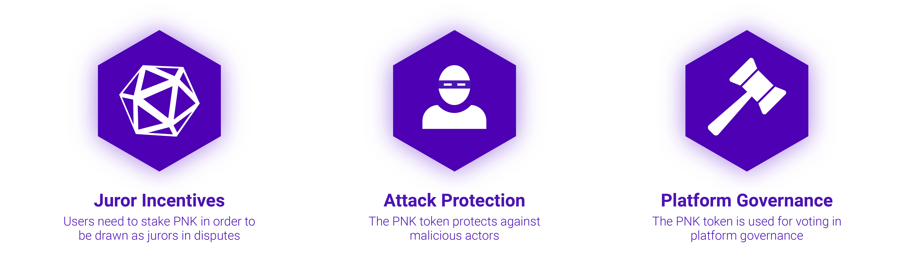

# PNK Token

⛓️ [**PNK Token Contract Address on Ethereum Mainnet**](https://etherscan.io/token/0x93ed3fbe21207ec2e8f2d3c3de6e058cb73bc04d)


#### Where to buy PNK?

* DEX Aggregators (Large Trade): 🔼 [Paraswap ](https://paraswap.io/#/)/ 🦓 [1inch](https://1inch.exchange/#/)
* DEX L1 (Medium Trade): 🦄\*\* \*\*[Un](https://app.uniswap.org/#/swap?inputCurrency=ETH\&outputCurrency=0x93ed3fbe21207ec2e8f2d3c3de6e058cb73bc04d)[iswap](https://app.uniswap.org/#/swap?inputCurrency=ETH\&outputCurrency=0x93ed3fbe21207ec2e8f2d3c3de6e058cb73bc04d) / 🍣 [S](https://app.sushi.com/swap)[ushiswap](https://app.sushi.com/swap?inputCurrency=ETH\&outputCurrency=0x93ed3fbe21207ec2e8f2d3c3de6e058cb73bc04d) / ⚖️ [Balancer](https://balancer.exchange/#/swap)
* DEX L2 (Small Trade): 🔷 [Deversifi](https://app.deversifi.com)
* Centralized Exchanges (Fiat Trade): 🍃 [Bitfinex](https://www.bitfinex.com/t/PNKETH) / 🚪 [Gate.io](https://www.gate.io/trade/PNK\_USDT/?ch=en\_sm\_0421) / 🆗 [OKEX](https://www.okex.com/markets/spot-info/pnk-usdt)
* Credit Card Onramp: 🛡️ [Guardarian](https://guardarian.com)


## What is PNK?

PNK is used both to stake (for the possibility to become a juror and to protect against attacks) and in the governance (voting rights) when new proposals, courts, or other parameters are suggested throughout our Dapps.

* **Voting Rights:** PNK is used for all governance decisions taken on the Kleros platform. Users can vote with their PNK in any related votes. We already use this mechanism in our token curated list and court governance decisions. \\
* **Staking Rewards:** Users must stake PNK in order to be able to become jurors in disputes. The more PNK a user stakes, the more chance he has of being chosen as a juror in the selected court.


**FAUCETS FOR TESTNET PNK**

Call `request` function to receive 10,000 PNK. It only gives once for each address.

* [Ropsten PNK Faucet](https://ropsten.etherscan.io/address/0x9AdCEAa6CFd7182b838Beb085e97729EB1Da681E#writeContract)
* [Kovan PNK Faucet](https://kovan.etherscan.io/address/0x4e95b2e0ecb3bd394e1dddd775504820a746d3bd#writeContract)
* [Rinkeby PNK Faucet](https://rinkeby.etherscan.io/address/0xb01c9de0e9de0a6cab6df586484707b7078de684#writeContract)
* _Contact the Kleros team if you need a PNK faucet on other testnets_


## Why Kleros Needs a Native Token? 

At Kleros we are building a blockchain-based, crowdsourced dispute resolution platform. An essential part of the mechanism-design is the native \_Kleros \_token (PNK).

The PNK ticker comes from "Pinakions" originating from Ancient Athens. These small bronze plates on which citizens’ names were written were inserted into a randomizing machine that selected for participation in juries and certain civil service roles. The name of the token used by Kleros is a reference to this practice.

For each dispute that is arbitrated by Kleros, some number of jurors are required. A jury as small as three people may provide an initial ruling of a dispute. Then if one of the parties decides to appeal the ruling, the number of jurors in subsequent rounds increases.

PNK holders can stake their tokens in a Kleros court to indicate their availability to serve as jurors. However, eventually, we will implement specialized subcourts and PNK holders will be able to choose which subcourts to stake their token in). In order to select the jurors for a case, random PNK are drawn from among those who have been staked, and the people who hold these PNK are the jurors.


**TOTAL SUPPLY**

PNK current total supply is 764,626,704 PNK. The supply can only be modified by the Kleros community through a DAO governance vote.


## Why Does Kleros Need its Own Token? 

First and foremost, PNK is a protection against [Sybil attacks](https://en.wikipedia.org/wiki/Sybil\_attack). In order for an attacker to flood the juror pool, they need to buy enough PNK so that they are selected enough times to be a juror for the same case in order to change the outcome. Generally, this means that the attacks need 51% of the total (staked) tokens.

An attacker may get lucky in rare circumstances and be selected for two of three juror spots with only a minority of the PNK. However, in order to maintain the attack through the appeal process, it would need to be selected for the majority of the juror spots on larger and larger juries, which will only be possible if the attacker actually has a majority of the PNK. Hence, substantial economic resources are required to perform a 51% attack.

So far, this would still be true if we had potential jurors stake ETH instead of PNK. However, using a native token offers several key advantages for minimizing the risk of 51% attacks versus using an external cryptocurrency.

### PNK makes an attack hard 

If would-be jurors were drawn based on how much ETH they had staked (rather than PNK), it would be much more viable for an attacker to try to buy enough ETH to outspend the rest of the market. If an attacker wants to obtain 51% of PNK, market liquidity will dry up. As the attacker buys PNK , it will start to become scarce and each additional PNK will cost more and more. The attacker may not even be able to find 51% of PNK for sale on the open market at any given time.

In contrast, consider the situation of an attacker who wants to buy enough ETH to make a stake that is greater than whatever would be already staked in Kleros courts at a given time. There is a lot of ETH floating around, and Kleros will presumably only represent a part of the broader Ethereum ecosystem.

[Current 24 hour market volumes for ETH are hovering around 2–3 billion USD with all time highs near 10 billion.](https://coinmarketcap.com/currencies/ethereum/) If someone wanted to buy enough ETH to overwhelm whatever is staked in Kleros, it probably wouldn’t take them all that long. Moreover, the market for ETH is much [deeper](https://en.wikipedia.org/wiki/Market\_depth) than the market for PNK will be. So, while a large purchase of ETH might move the price of ETH a bit, market liquidity effects woudn’t come to Kleros’ defense in the same way as they do by having a native token.

### PNK makes an attack expensive 

Imagine that someone **does** buy 51% of the PNK in an effort to attack Kleros. Maybe their attack will be subtle and go unnoticed. However, more likely the community will realize that it is under attack, particularly if the attacker uses her new PNK to commit obvious miscarriages of justice. In this case, Kleros would lose credibility as an arbitration platform and the value of PNK would decrease. Then the attacker would take a substantial loss on the PNK she bought, representing a high economic cost to carry out the attack.

On the other hand, an attack on Kleros would presumably not have that large of an impact on the price of ETH. So, if stakes were made in ETH, an attacker could perform her attack after which she could sell her ETH without taking too much of a loss.

### PNK makes Kleros forkable 

Finally, in the extreme case of a successful 51% attack, by having a native token, it is possible to perform a last-ditch defense of forking the system to remove the attackers’ holdings. Then the market would sort out which version of PNK should be used going forward. This would of course be highly disruptive as any pre-existing contracts designating Kleros as their arbitrator would continue to use the old version of PNK by default. Still, it would offer the community a path forward out of disaster that would not be available without a native token. This is similar to the [ultimate appeal mechanism of Augur](https://medium.com/kleros/kleros-and-augur-keeping-people-honest-on-ethereum-through-game-theory-56210457649c).

On the left, an attacker has managed a 51% attack and starts carrying out obvious miscarriages of justice. The community decides to fork the token removing the attackers’ holdings, and most of the users migrate to the new version of PNK.

Ultimately, the integrity of juries is the essence of what the Kleros protocol aims to provide. As such, it is key to maximize their defense against 51% attacks. This is why Kleros needs its own native token.

**More details:** [https://medium.com/kleros/why-kleros-needs-a-native-token-5c6c6e39cdfe](https://medium.com/kleros/why-kleros-needs-a-native-token-5c6c6e39cdfe)

## Conclusion

To summarize, Kleros needs its own token as a defense against 51% attacks. This token gives users the ability to be selected as jurors. As such, users should have an interest in holding PNK tokens because of the opportunity that these tokens represent to receive fees and rewards for coherence for arbitrating disputes.
