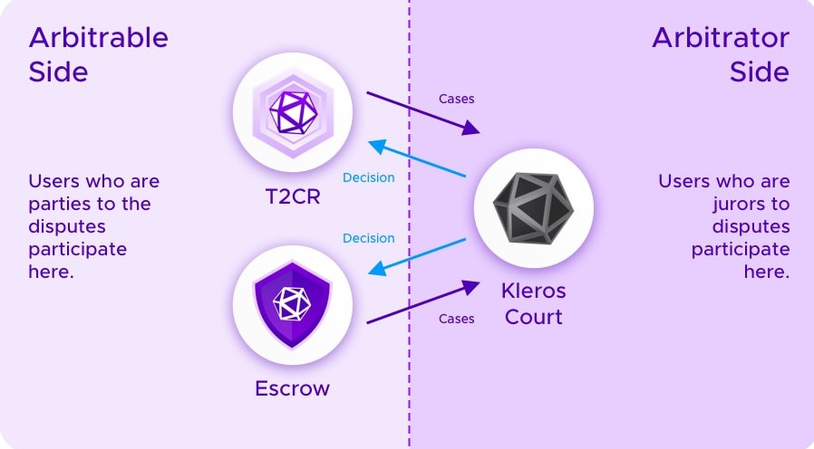

# Court

[Kleros Court](https://court.kleros.io/) is the core engine of the Kleros portfolio of services and products.   
  
It is a dispute resolution protocol that provides arbitration for the type of subjective conflicts that smart contracts do not address. This is done by having a set of jurors randomly drawn for each dispute and having them vote to ensure a given verdict.

### Understanding How Kleros Works

Kleros works in a simple way. Disputes are created by dApps and sent to the [Kleros Court](http://court.kleros.io/). All dApps send their disputes to the 'arbitrator side' \(meaning the court\), thus their side is called the 'arbitrable side'. 

### Kleros Court Process

The Kleros court process works in the following way:

* Once a Dapp sends a dispute, the system randomly picks jurors in a court specified for the case in question.
* The case enters the evidence submission period where all interested parties \(disputing parties, jurors, challengers, and any external agent\) are able to submit their evidence.
* After the evidence period is finished, jurors are able to vote on the case. For now, Kleros jurors can vote 'Yes', 'No' and 'Refuse to Arbitrate'. The third option is available in cases of an invalid submissions, illegal or morally unacceptable content or evidence. 

### Courts and sub-courts

When creating an arbitrable contract, parties should choose a type of court specialized in the topic of the contract. A software development contract will choose a software development court, an insurance contract will select an insurance court, etc. The structure of the set of courts forms an arborescence with the General Court as
 the root.

* Marketing Services: jurors in this court solve disputes regarding the quality of paid marketing services including but not exclusive to sponsored articles, social media promotion and PR writing.
* English Language: jurors adjudicate disputes arising from translation tasks created via Linguo.
* Video Production: as the name suggests, this court deals with disagreements that arise between parties regarding videos contracted through Kleros Escrow.
* Onboarding: this court is essential for new jurors, as it's a quick court that deals with small disputes on varied topics, giving a new juror a chance to test their mettle.
* Curation: jurors here have a chance to vet contents of lists and registries of all kinds, based on the lists' acceptance criteria.

