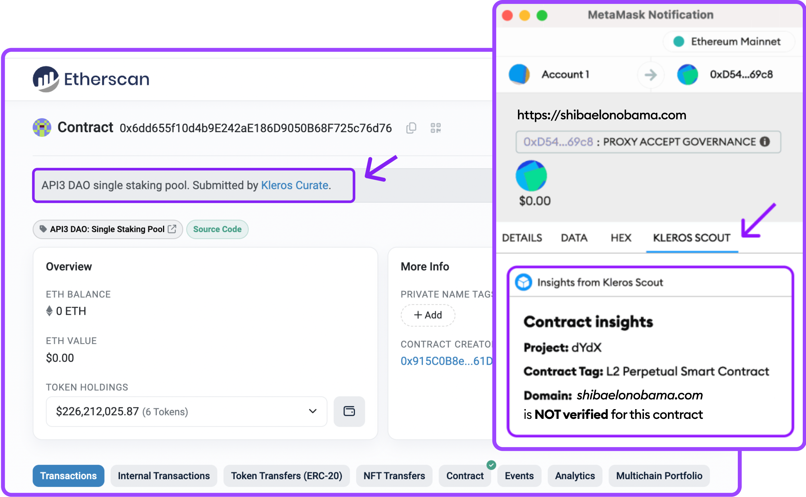

# Partnerships

Many of the most important Web3 partners already use data from Kleros Scout, recognizing the value of fully decentralized and permissionless data curation, and supporting a safer blockchain ecosystem.

<figure><figcaption></figcaption></figure>

## Why Integrate data from Kleros Scout?

**User Confidence:** Verified contract data helps users feel secure when interacting with assets on your platform.

**Improved Conversion Rates:** When users see real-time, verifiable insights, they feel reassured. This extra layer of confidence makes them more likely to complete transactions.

**Clear Verification Process:** Data comes directly from decentralized, on-chain sources, ensuring accuracy and tamper-proof information. Users can check how an item was verified&#x20;

**Protect Users from Scams**: Displaying verified contract security data can help prevent scams, phishing, and fraudulent transactions.

**Reduce Legal Risks** :Publicly showing verified information demonstrates due diligence, reducing liability for hosting fraudulent assets.

**Lightweight & Easy to Integrate** :Kleros Scout data can be displayed effortlessly without disrupting platform operations.

## How to integrate Kleros Scout data into your platform?

Partners like Ledger and Etherscan directly display Scout data on their platforms.

In partnership with MetaMask, we developed a dedicated plugin that provides real-time information about the specific contract or address during the transaction, directly in MetaMask wallet. Check the[ dedicated section ](kleros-scout-metamask-snaps/)to learn how to use it!

<figure><figcaption>
On the left, how Kleros Curate information are displayed on Etherscan. On the right, how you will see insights in real time directly on your Metamask wallet with Scout Snap!
</figcaption></figure>

## Want Scout Data in Your App?

Check our dedicated section [here](../../../integrations/types-of-integrations/2.-curated-data-integration-plan/), or Message us on [Telegram](https://t.me/kleros)

\
\
\
