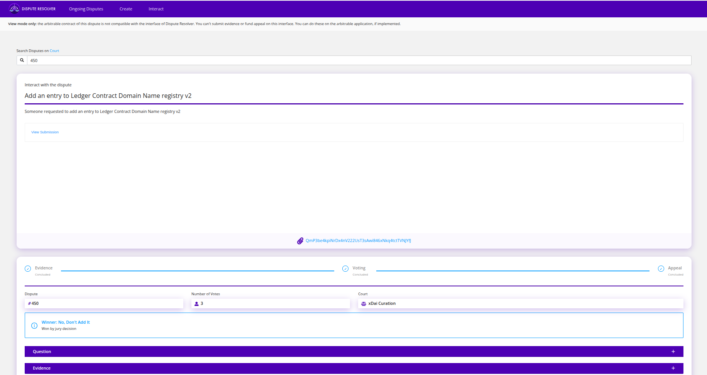

# Enterprise

<figure><figcaption></figcaption></figure>

<strong>How is Kleros different from other Dispute Resolution Methods?</strong>

Thanks to its innovative mechanism, Kleros has the potential to be more efficient than traditional courts or arbitration. It uses blockchain for transparency and automation, and relies on crowdsourced decision-making: disputes are resolved by randomly selected jurors from a decentralized pool, who apply clear rules and vote independently. This use of collective intelligence enables Kleros to scale to a high volume of cases while keeping costs low for the parties involved.

<strong>What types of disputes is Kleros best suited for?</strong>

Kleros is a natural fit for Web3 and DAO ecosystems. It allows decentralized communities to resolve disputes without centralized intermediaries, with decisions enforced automatically by smart contracts. This makes it particularly useful for use cases like protocol governance, on-chain moderation, oracle disputes, and enforcement of rules in decentralized platforms.

It’s also well suited for “real world” disputes, specially those that are high in volume and low to medium in value, such as e-commerce, freelance work, insurance claims, or consumer complaints, where other dispute resolution mechanisms might be too slow or expensive. Kleros provides a faster and more cost-effective alternative while still ensuring fairness and procedural integrity.

<strong>What does "Enterprise" mean in the context of Kleros?</strong>

In Kleros, "Enterprise" refers to the use of Kleros’ dispute resolution technology by companies, institutions, or governments to resolve disputes within their own platforms or services. The key difference is that the complexity of blockchain is abstracted away—neither the organization nor its users need to handle crypto or interact directly with smart contracts.

<strong>Why should companies use Kleros?</strong>

Integrating Kleros gives companies a fast, affordable, and transparent way to resolve consumer disputes—without the need for lengthy and expensive legal processes. By offering users a fair dispute resolution option, companies can increase trust and user retention, while reducing legal costs. It also shows commitment to fairness and user protection, which enhances brand reputation and loyalty.

<strong>Why should governments use Kleros?</strong>

By integrating Kleros, governments can expand access to justice with a scalable, low-cost, and transparent online dispute resolution system. This is especially valuable in addressing the growing number of claims—speciallly in consumer protection—and the limited capacity of traditional courts. Kleros helps ease the load on overburdened judicial systems and ensures faster, fairer outcomes for citizens, while promoting innovation in public service delivery.

<strong>Has Kleros been used to resolve real world disputes?</strong>

Yes. Kleros has already been adopted for real-world use cases. For example:

* **MetLife Mexico:** One of the world’s leading insurance companies is using Kleros to resolve actual insurance-related disputes in a controlled pilot in México.
* **Lemon Cash:** with +3 million users, the Latin American Fintech company uses Kleros to resolve consumer complaints. More than 100 cases were resolved in Kleros.

- **Mendoza Supreme Court (Argentina):** A groundbreaking pilot was launched with the judiciary to explore the use of Kleros in small claims consumer and neighbourhood disputes.

* [**Maldo.uy**](http://maldo.uy)**:** an online p2p services marketplace uses Kleros to resolve disputes between independent service providers and their clients.

<strong>How does Kleros ensure procedural fairness?</strong>

Kleros enforces procedural fairness by embedding core principles of due process and constitutional rights into its system design:

* **Clear rules and equal treatment:** Every case is governed by transparent policies that are publicly available and applied equally to both parties. This ensures consistency and predictability in decisions.

- **Predefined and immutable procedures:** The procedural framework—such as deadlines, evidence stages, voting periods, and appeal windows—is fixed in advance by smart contracts. Thanks to the immutable nature of blockchain, these procedural rules cannot be secretly altered or manipulated, ensuring integrity, predictability, and protection against due process violations.

* **Right to be heard:** All parties have the opportunity to present their case. Because Kleros is open and decentralized, no central authority can block or prevent access to the system. They can submit any type of digital evidence—documents, images, expert reports, web links, or even video testimony—ensuring broad access to procedural participation.
* **Notice and transparency:** Parties receive timely notifications (e.g. email alerts) when a dispute is initiated. In peer-to-peer contracts, this is reinforced by arbitration clauses that define how and when notice must be given.

- **Independence and impartiality:** Jurors are randomly selected from a large pool, significantly reducing bias or collusion. Their financial incentives are aligned with honest and coherent decision-making: jurors who vote contrary to the majority without proper justification may lose stake, while those who follow the best interpretation of the rules are rewarded.

* **Right to a reasoned decision:** In some cases, jurors have additional economic incentives to properly justify their votes based on the evidence and the applicable policy, reinforcing the quality and legitimacy of decisions.

- **Right to appeal:** If a party believes the outcome was flawed, they can appeal to a higher court composed of more jurors, adding procedural layers and enhancing the review process—similar to appellate safeguards in traditional systems.

* **Access to justice and cost-efficiency:** Kleros removes many procedural and financial barriers typical of traditional legal systems, offering fast, low-cost, and accessible justice—particularly for low-value or digital-native disputes that courts often overlook.

These mechanisms allow Kleros to uphold core legal principles such as due process, impartiality, legal certainty, and the right to a fair hearing—making it compatible with constitutional principles across jurisdictions.

<strong>What is the compliance rate for Kleros decisions?</strong>

For “Enterprise” disputes, companies voluntarily and explicitly agree to be bound by Kleros’ decisions. This constitutes a contractual obligation toward their users (and even us), which we require as a condition for integration. To date, we have not encountered any instance of a company refusing to comply with a Kleros ruling. However, if such non-compliance were to occur, the user would retain all available legal remedies, including the option to bring the matter before a court. Additionally, the company would face significant reputational damage for failing to honor a process it voluntarily agreed to uphold. If you want to know more about these types of integrations, [here](https://www.google.com/url?q=https://wiki.lemon.me/es-ar/institucional/justicia-descentralizada-en-lemon\&source=gmail\&sa=D\&sa=E).

<strong>Can Kleros decisions be recognized as arbitral awards?</strong>

Yes. Kleros produces decisions that could be recognized as arbitral awards as long as the arbitral clause is properly written and the process is designed to respect key elements required by applicable arbitration law. In most cases, countries have adopted the [UNCITRAL](https://uncitral.un.org/en/texts/arbitration/modellaw/commercial_arbitration/status?utm_source=chatgpt.com) Model Law on International Commercial Arbitration, which provides flexibility and allows parties to freely choose their arbitration procedure. This means that parties could agree, within their arbitration agreement, to use Kleros as their dispute resolution mechanism.

For deeper analysis, see [this thesis](https://www.google.com/url?q=https://cdn.kleros.link/ipfs/QmWqmoEXcmKHgeKX3NUk9mMRssZymUj9sYQSQ3vvxTiyDA\&source=gmail\&sa=D\&sa=E) explaining how Kleros decisions can be recognized and enforced as foreign arbitral awards under the New York Convention.

In a landmark [case](https://cdn.kleros.link/ipfs/QmRNyeRQVpfP4xovAdZBjYQ3TrYFJP3YKjEKUoMLSnoXnH/Mauricio%20Virues%20Carrera%20-%20Reporte%20del%20Kleros%20Fellowship%20of%20Justice.pdf) in Mexico, a Kleros jury's decision was recognized and enforced as an arbitral award. This case used a hybrid approach where an identified arbitrator was selected and adopted Kleros sustantive ruling in a formal arbitration award.

<strong>What about jurisdictions where written arbitral awards are required to be signed and issued by identified adjudicators?</strong>

If the applicable law requires a signature from the arbitrator, and the legal framework recognizes the equivalence of digital signatures to physical ones, one could reasonably argue that Kleros awards are indeed “signed” by the arbitrators. This is because each juror must execute and sign a blockchain transaction to cast their vote, and this signature is cryptographically linked to the juror's unique account, ensuring authenticity and non-repudiation. Regarding anonymity, if the legal system or arbitration rules require identifiable arbitrators, there are mechanisms available to meet that standard. The V2 version of Kleros courts allows configuration to whitelist and grant access only to jurors who meet specific criteria, for example, those who have completed an identity verification process and fulfill qualification requirements (such as being licensed lawyers). This ensures that the identity of each juror is known or can be verified. For more ingormation, please refer to [this paper](https://www.google.com/url?q=https://cdn.kleros.link/ipfs/QmWqmoEXcmKHgeKX3NUk9mMRssZymUj9sYQSQ3vvxTiyDA\&source=gmail\&sa=D\&sa=E).

<strong>Can Kleros be used under dispute resolution schemes other than arbitration?</strong>

Yes. Beyond arbitration, Kleros can also serve in other dispute resolution roles:

* **Mediation:** The designated mediator can leverage Kleros platform to provide faster dispute resolution. The mediator helps parties prepare their binary position documents for Kleros, and submits them to Kleros. After the Kleros decision, the mediator helps ABC and XYZ incorporate the decision into a Master Settlement Agreement (MSA), which is enforceable under the 2019 Singapore Convention on Mediation. In this way, the hybrid model allows a complex construction dispute to be broken down into separate issues and independently resolved, which may not only lead to a faster resolution, but also a more satisfying and fair outcome for both parties. For more details, see [this research paper](https://blog.kleros.io/innovating-dispute-resolution-a-cohesive-approach-blending-traditional-mediation-and-kleros-blockchain-arbitration/).
* **Consumer Ombudsman:** Kleros can act as a decentralized consumer ombudsman, where consumers submit disputes about products or services and jurors evaluate claims fairly and transparently. We are currently piloting this approach in Argentina, enabling consumers to resolve conflicts faster, and without costly litigation for the Company.
* **Consultative layer:** Kleros can provide non-binding expert or common citizens opinions to assist judges or authorities in their decision-making, acting as a consultative body. The [Supreme Court of Mendoza](https://blog.kleros.io/kleros-y-el-poder-judicial-de-mendoza-pioneros-en-justicia-descentralizada/), a province in Argentina, has integrated Kleros as an auxiliary tool in its judicial decision-making process.
* **Other ADR schemes:** In 2024, Mexico passed a law recognizing decentralized justice systems as valid alternative dispute resolution methods. Under this law, resolutions from Kleros can be final and enforceable if parties agree beforehand.

<strong>What are the main institutional obstacles that prevent Kleros decisions from being recognized or enforced by national legal systems?</strong>

The main obstacle is a lack of familiarity and legal precedent. Kleros decisions, when supported by a valid arbitration agreement and a properly designed process, can meet the standards of international arbitration under frameworks like the UNCITRAL Model Law, which gives parties broad freedom to define procedural rules. Judicial skepticism often stems from the system’s decentralized and pseudonymous nature, but as new generations of judges and regulators emerge, and as government collaborations expand, this resistance is likely to diminish. Kleros is actively engaging with governments to foster understanding and open pathways to formal recognition.

<strong>What’s the vision of Kleros for the next years?</strong>

Kleros is already making strides: it was recognized as a valid alternative dispute resolution (ADR) mechanism in Mexico, we have signed the first-of-its-kind agreement with Mendoza’s Supreme Court, and important traditional companies are benign to use Kleros to solve disputes with their users. Over the next 5-10 years, Kleros may become a widely recognized layer for digital and low-value dispute resolution, both in Web3 and in real-world sectors like insurance, consumer protection, and public administration.

