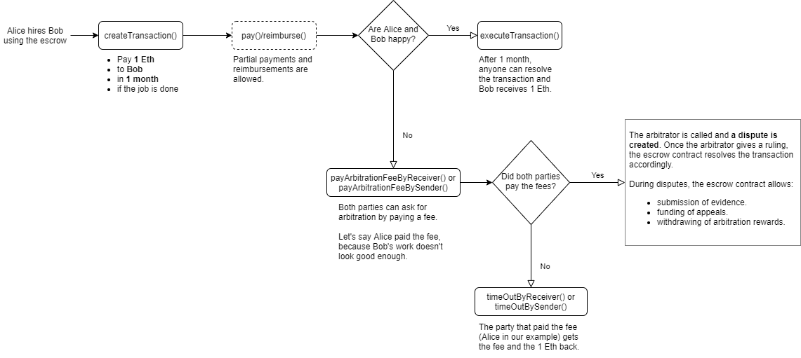

# Kleros Escrow Specifications

This page describes the flow of MultipleArbitrableTransactionWithAppeals, which is a version of Escrow contract with appeal support. For the sake of simplicity, this contract will be also referred to as Escrow.

### **Constructor \(deployed by the cooperative\)**

The constructor of the contract includes:

* Address of the arbitrator contract
* Extra data for the arbitrator to define court parameters
* Time each party has to pay the dispute fee
* Multiplier for calculating the appeal fee in the situation when there is no winner and loser in the previous round \(e.g. when arbitrator gave "0" ruling\)
* Multiplier for calculating the appeal fee that must be paid by the winner of the previous round
* Multiplier for calculating the appeal fee that must be paid by the party that lost the previous round

### **Create transaction**

The flow starts when the transaction is created. The creator of the transaction \(sender\) should deposit the amount that will be held in Escrow and also should specify:

* The address that will receive the funds if the service is successfully provided \(receiver\)
* Timeout after which the funds can be automatically transferred to the receiver if the transaction is not disputed. Note that large times can be put in order to effectively not have any timeout.
* Link to the meta-evidence file that provides the context of the potential dispute, the question the arbitrators have to answer, the human readable meanings of rulings and specific modes of display for evidence.

### **Pay / Reimburse**

The sender can use _pay\(\)_ function to transfer the funds locked in Escrow to the receiver, as a payment for the provided services. Conversely, the receiver can use _reimburse\(\)_ function to unlock some of the Escrow funds and transfer them back to the sender, if the services can't be provided fully.

If the transaction's timeout has expired then it can be executed by any address, thus transferring all the locked funds to the receiver.

Note that all these options are only available if there is no dispute.

### **Dispute**

If the sides can't reach an agreement they can create a dispute in Kleros court. In order to do so both sides must pay arbitration fees, which can be done with functions _payArbitrationFeeBySender\(\)_ and _payArbitrationFeeByReceiver\(\)_, for the sender and receiver respectively. When one of the parties fully pays its fees it waits for the other side to do the same. If both parties pay their fees in time the dispute is created.

The required arbitration cost value can be obtained with: _arbitrationCost\(\_extraData\)_

where arbitrationCost\(\) is the function of the arbitrator contract. This function returns the amount in wei and requires the extra data \(the same that was used in constructor\) to be passed as an argument.

If the party doesn't pay arbitration fees in time it can be timed out either with function _timeOutBySender\(\)_ or _timeOutByReceiver\(\)_, depending on the party that didn't pay. In this case the party that fully paid the fees wins and gets all the locked funds. Both parties have their arbitration fees fully reimbursed in this case.

When the dispute is created it can be resolved with 3 possible outcomes:

The sender wins and gets all the locked funds and also gets his arbitration fees reimbursed.

The receiver wins and gets all the locked funds and also gets his arbitration fees reimbursed.

The court didn't favor either of the parties. In this case the reimbursed fees and locked funds are split equally between the parties.

Until the dispute is resolved the parties can use _submitEvidence\(\)_ function to provide evidence that supports their claims.

### **Appeal**

The dispute ruling can be appealed by depositing the appeal fee within the dispute's appeal period. If appeal funding is successful it starts the new funding round and the dispute will be arbitrated again. Appeal fees can be crowdfunded and the sum of both fees will be distributed proportionally between crowdfunders who contributed to the winning side. Note that the UI doesn't need to initially allow crowdfunding but can only deal with users paying for themselves.

The required appeal fee value is computed by the formula:  
_appealCost\(\_disputeID, \_extraData\) \* \(10000 + multiplier\) / Divisor_

Where _appealCost\(\)_ is the function of the arbitrator contract, which returns its appeal cost and requires _\_disputeID_ and _\_extraData_ to be passed as arguments. The former is the ID of the dispute given by the arbitrator when the dispute is created and the latter is the same extra data value that is used in Constructor.

_multiplier_ is the stake multiplier that is defined by the winner of the previous round. It can be either:

* _sharedStakeMultiplier_, if the dispute didn’t have winner and loser in the previous round \(e.g. when arbitrator gave "0" ruling\)
* _winnerStakeMultiplier_, if the funded party is the winner of the previous round
* _loserStakeMultiplier_, if the funded party lost the previous round

These multipliers are set when the contract is deployed.

_Divisor_ is a constant value equal to _10000,_ because the multipliers are in basis points.

The appeal rewards can be withdrawn with function _withdrawFeesAndRewards\(\)_ when the transaction is resolved.

If the dispute is not appealed it receives the final ruling from the arbitrator and the transaction is marked as resolved.

If only one side has paid its appeal fees then it wins the dispute regardless of the final ruling.

