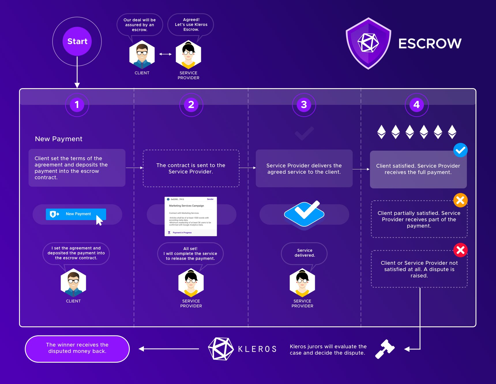

# Kleros Escrow Tutorial

**Kleros Escrow** is a secure and decentralized escrow Dapp that can be used for any exchange of goods, assets, or services involving an Ethereum-based asset.

Using Kleros Escrow, you can transact in the blockchain ecosystem for services, products, and assets using our simple solution with a level of trust not yet known outside the traditional commerce space. If a dispute happens, it will be adjudicated by crowdsourced jurors selected and incentivized by the Kleros protocol.

## TUTORIAL

(One tab for each step)



To start an Escrow transaction, you will need to connect your wallet and initiate a new payment or invoice.

### 1/ Initiating a Payment

#### 1.a/ Go to the [Kleros Escrow](https://escrow.kleros.io) website

* If you don't have a web3-enabled browser, you will need to connect your **Metamask** wallet or **WalletConnect** to use the Escrow service.

.png>)

* Once you have connected the wallet to the app (the wallet will ask you to confirm the connection), you will need to ensure you have some Ether (ETH) loaded in the wallet to interact with the Ethereum blockchain (pays transaction fees) and to be able to pay for the Escrow transaction you'll be setting up later.

.png>)

* You should now be able to see the homepage shown below

.png>)

* The homepage offers you the chance to create new escrowed transactions and review those that are open, in progress, pending dispute, or closed.


**INFO**\
**If you already had some escrowed transactions in progress, they will be displayed on the homepage as shown in the screenshot below.**


.png>)

#### 1.b/ Subsribe to notifications

* Before we get started, remember to sign up for email notifications to not miss any important deadlines. It is important as if one of the parties raise a dispute about the payment and you do not answer, they could win the case automatically.

 (1) (1).png>)

#### 1.c/ Create a new Payment


**WHAT DOES "PAYMENT" MEAN?**\
\*\*\*\*Creating a payment means that you will be the person in the transaction that will pay for the service or good and lock the amount of the payment in the Escrow smart contract. If you are the person receiving the Ethereum-based funds, select "New Invoice" instead and then share the link to the invoice details with the person who will lock the funds in the escrow.


* To start configuring an escrowed payment, click on the blue "New Payment" button on the top right (or the "Create New Payment" card).

.png>)

#### 1.d/ Select an Escrow Type

* On creating a new payment you'll get an option to select the type of Escrow transaction you want to create. Select one and click on "Next".

.png>)


**TYPES OF ESCROW TRANSACTIONS**

**Cryptocurrency Transaction**

Select this option if you want to trade or exchange a crypto asset for another crypto asset. It is especially useful where one of the assets is on a specific blockchain other than Ethereum. For example trading ETH on Ethereum for SOL tokens on Solana.

**General Service Transaction**

Select this when paying for any other type of general service provided. This allows you to specify your own terms for the agreement and upload a document when creating the payment.




In this step, you will specify the details of the Escrow transaction to be made between parties and lock the funds in the Escrow.

### 2/ Submitting a Payment

#### 2.a/ **Submitting a General Service Payment**

* When selecting a General Service payment you'll be asked to fill out a form providing basic information about the payment like the Ethereum address that'll receive the funds, the amount and the type of asset for the payment.
  * A title for the transaction
    * Ex: "Marketing Mission with John D." ; "ETH to SOL trade"; "Physical NFT delivery"
  * An Ethereum address for the funds receiver
  * An amount and unit of ETH or ERC-20 tokens to be paid

.png>)

* If you wish to pay with an ERC-20 token, click on the asset dropdown to select another asset. The tokens displayed are those who received the "ERC-20 badge" in Kleros Token List. If you don't find the token, you want to use in this list, click on "Add Custom Token" and add the information of the ERC-20 token (from the Etherscan token contract page).

.png>)

Here you can also select to:

* Enable **Automatic Payments** which will automatically release the funds form the escrow if no dispute is raised by either party.


**INFO**

Upon clicking the "Automatic Payments section", a calendar will appear allowing you to select the deadline for the escrow contract.

This is an important setting in which the contract execution date will be determined. If no disputes are raised before this deadline, the transaction will be automatically processed.

Before this timeout has passed, the receiver should have sent the product or service to the sender or the contract should be in dispute status.

Once the contract timeout has passed, the receiver can manually call the contract which will, in turn, release the funds.


* Upload an **Agreement Document** detailing the specifics of the agreement between the parties or manually type in the terms in the Contract Information section

.png>)


**IMPORTANT**\
\*\*\*\*The Agreement Document or Contract Information text are an important parameter that'll be relied upon by the jurors in the event of a dispute raised. Try to clearly specify the terms of the contract between parties. It should describe the parties, the nature of the service/good expected and the conditions of the enaggement to be complied with.


#### \*\*2.b/ \*\*Submitting a Cryptocurrency Transaction Payment

* When creating a Cryptocurrency Transaction, in addition to the above details same as for a General Service Payment, this requires additional details such as the Name of the non-Ethereum Blockchain, the address on that chain where funds should be transferred to, the crypto asset name and amount, as well as the due date for the transfer to be completed.

.png>)

* Once you have entered these details the contract Information for the cryptocurrency transaction should be automatically filled in.

.png>)

#### 3.c/ Submit Transaction

* Once all the details are filled in; you should now be able to click on the "Next" button allowing you to review the complete details of the Payment and finally click on the 'Submit' button to submit the transaction by paying the payment amount that will be escrowed (+ gas fees).


**INVOICE**\
If you are not the person who will lock the funds in the Escrow, the "Invoice Details" will allow you to copy the URL and share the Escrow link to the person who will trigger the payment.


.png>)

The payment will remain in the escrow contract until the service described is completed or the timeout date of the contract passes.

Once the payment is submitted and the transaction is mined, you will be redirected to the payment page.

The My Payments dashboard will be updated with all the status of the escrow payments as shown below.

 (1) (1).png>)



After the service has been provided or trade has been made successfully, this is how you can finalize the transaction. Whilst you wait, all your escrow contracts are held in the My Payments dashboard showing their current status.

Now, if you click on the escrow contract you just created, you will see a\*\* \*\*summary of the payment details, a yes/no option, and, if applicable, a timeout date and time at the bottom of the page.

### 3/ Executing Payment

#### 3.a/ Payment Sender

If you are the sender of the payment you'll see the following options for an existing payment

.png>)

* **Yes**: Select Yes if the other party successfully performed the required action or service and pay them the full amount.

In the final screen, you'll see a confirmation that the payment was made successfully.

* **No**: Select this if you're not satisfied with the outcome/action by the other party. You'll then have an option to either settle with a partial amount or raise a dispute to the Kleros court for arbitration

#### 3.b/ Payment Receiver

If you are the receiver of the payment you'll also have two options for an existing payment transaction

.png>)

* **Yes**: Select this option in case you are unable/unwilling to perform the required action for any reason and refund the sender the fund amount.
* \*\* No\*\*: Select this if you reach a midpoint with the sender and propose a settlement or the sender has refused to make the payment even after the agreed terms are fulfilled and raise a dispute.



If the Payment Sender did not agree on releasing the full payment and the service/item provide did not agree to reimburse fully the payment sender, then, the next step is to try to settle by waiving part of the payment (= paying partially). This will leave the remaining amount of the payment up to being released on one or the other side.

Maybe you contracted for some freelancing work that was _sort_ of completed correctly with the contractor deserving of some recompense.

If the other party agrees, the payment is made and the escrow contract is closed. If not, the case can still go to a\*\* \*\*dispute should either party not agree to the partial payment.

**Note:** If you get the other party to digitally sign saying they agree to a settlement, and then they raise a dispute on the remaining amount after a waive, you can use your communications as evidence to win that dispute.


**INFO**

If you get the other party to digitally sign saying they agree to a settlement, and then they raise a dispute on the remaining amount after a waive, you can use your communications as evidence to win that dispute.


### 4/ Agree on a settlement

If there is a disagreement on the payment by either party then either party can waive a part of the payment before raising a dispute.

.png>)

When a part of the payment is waived the other party can then reevaluate and choose to then either refund or pay the remaining amount or still decide to raise a dispute, the same way it was done in Step 3.


**WARNING**

In the current version of Kleros Escrow, waiving a part of the payment immediately transfers the waived amount to the other party and will not be considered if a dispute occurs over the remaining amount.




Whether a partial settlement has been made or not, any of the 2 parties can raise a dispute for the full or remaining payment amount by paying the arbitration fee (that is reimbursed if you win the case). Both parties must pay the arbitration fee. This fee is used to pay coherent jurors in any dispute.

### 5/ Raise a dispute

#### 5.a/ Raise the Dispute

To raise a dispute either party can select No while a transaction is pending and then click on the Raise Dispute button to pay for the arbitration fees and start the process for arbitration by the Kleros court.

.png>)

Once a dispute is raised by any party the other party has a limited period of time to pay their side of the arbitration fees after which the Kleros arbitration process starts and can take at least 5-7 days depending on the Kleros court parameters.

The UI will update once you have paid the arbitration fee to show the time left for the other party to pay.

Below we can see the counter party's notification of payment.


**INFO**

If the other party fails to pay for their side of the fees then the first paying party automatically wins the dispute and can withdraw their funds.


#### 5.b/ Share Evidence

By opening the disputed escrow payment, you are now able to add evidence to the case. The original agreement document details the initial contract and you can add your own evidence as shown below. Best practice would be a PDF file with [EXIF data](https://www.pdfyeah.com/remove-pdf-metadata/) stripped to preserve anonymity.

#### 5.c/ Monitor the dispute

You can monitor the progress of the dispute on the escrow payment page or on [https://resolve.kleros.io/ongoing/](https://resolve.kleros.io/ongoing/)

Once a first ruling has been made by the Kleros court, anyone who is not satisfied by the ruling can choose to appeal the court ruling asking for another round of ruling with more jurors drawn than before as well as providing additional evidence for the jurors to judge.

When the final ruling is made, the winning party can withdraw its funds from the escrow.

[Learn more about the dispute process.](https://kleros.gitbook.io/docs/products/court)


