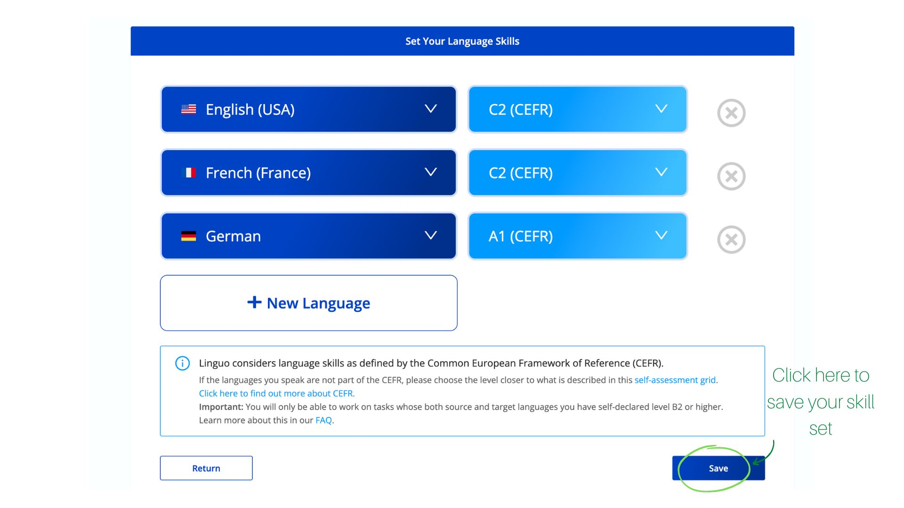

# Reviewing translations

1. Click the Review Translations option to see available translations to be reviewed.

.jpg>)

2\. Create a profile and fill in your language proficiency details.


Please make sure you do the self-assessment accurately as this would ensure you get matched to jobs that you are most suited for.


3\. Now you will see all open translations for review.

4\. Once you have chosen the file you’d like to review, gather your evidence and challenge the submission.

5\. Once you’ve submitted the evidence and made the challenger deposit the case will be sent to the respective courts to be evaluated by the jurors.&#x20;


**What happens now?**

If your challenge is rejected you lose the challenger deposit.

If your challenge is approved;

your payout = translator deposit + (challenger deposit - arbitration fees)

