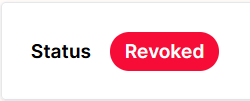

# Proof Humanity 2.0 Tutorial (Remove & Challenge)

❓ Check out the [FAQ ](https://kleros.gitbook.io/docs/products/proof-of-humanity/poh-faq)or [Part 1 of the PoH Tutorial](https://kleros.gitbook.io/docs/products/proof-of-humanity/proof-of-humanity-tutorial) if you don't find your answers here.



### 5/ <mark style="color:orange;">Challenge a claim</mark>

If you want to help to maintain the PoH registry and earn money by spotting fake, sybil, deceased and incorrect profiles, you will need to learn how to challenge these types of profiles when they are in '_<mark style="color:blue;">Pending Claim</mark> or <mark style="color:orange;">Pending Revocation</mark>_' status.

**5.a/ Browse through the '**_<mark style="color:blue;">**Pending Claim**</mark>_**' or '**_<mark style="color:orange;">**Pending Revocation**</mark>_**' profiles and check them**

* Go to the [PoH app](https://v2.poh.id/) and filter the profiles for '_<mark style="color:blue;">Pending Claim</mark>_ or '_<mark style="color:orange;">Pending Revocation</mark>_' profiles. The filter is on the right just above the profiles&#x20;

 

<figure><figcaption></figcaption></figure>

* Once you have applied the filter, click on each profile one by one to check if their information, photo, and video follow the [PoH guidelines](https://cdn.kleros.link/ipfs/QmcEvNrofibGt1MQSCk7G1fFboiMyfHoYyns4En4kWG5hU) or if you can spot deepfake photo and videos.


You can use deepfake detection tools such as [https://deepware.ai/](https://deepware.ai), [https://sensity.ai/](https://sensity.ai) or other more powerful deepfake detection algorithms to help you in this enterprise. You can also use Voice Recognition Software to spot computer-generated voices or compare old and new submissions.


* If you find a profile that violates the guidelines, ensure that you have enough funds in your wallet and challenge the profile by clicking on the '<mark style="color:orange;">Challenge'</mark> button at the top right of the profile page.

* This will open a modal asking you for a reason to the challenge. Select the relevant reason and include justification then click on '<mark style="color:orange;">Challenge Request</mark>'.

* Send the transaction with the challenger deposit. Once the transaction is validated, the profile will soon go to '<mark style="color:orange;">Disputed Claim</mark> or <mark style="color:orange;">Disputed Revocation</mark>' status.

<figure><figcaption>
a sample from a Sepolia testnet profile
</figcaption></figure>


**What is the Challenger Deposit?** The deposit is an amount of ETH or xDAi you lock with the challenge of the profile that will act as a deterrent to prevent people from challenging profiles for no valid reason. If your challenge of the profile is successful, you get your challenger deposit back and earn the submitter deposit (minus arbitration fees). If you have challenged a valid profile, you will lose this deposit.


* A dispute will then be raised in [Kleros Court](https://kleros.gitbook.io/docs/products/court) where jurors will vote on a ruling. Anyone can submit evidence from the profile interface (at the bottom of the page)

.png>)

* Now, you just have to monitor the progress of the dispute through the profile interface over the following 5 to 7 days. If you don't agree with the final ruling, you will have the possibility to appeal.



### 6/ <mark style="color:orange;">Remove a profile from the registry</mark>

**6.a/ Remove your own profile still in '**_<mark style="color:purple;">**Vouching**</mark>_**'**

* In order to remove your own profile in '_<mark style="color:purple;">Vouching</mark>_' status, you need to go to your profile page and click on the '<mark style="color:orange;">Withdraw</mark>' button.

* You will get your deposit back once the transaction is validated.

**6.b/ Remove or revoke a profile in Registered status or '**_<mark style="color:green;">**Resolved Claim**</mark>_**'**

* In order to remove or revoke a registered profile, you need to go to the registered profile page and click on the '<mark style="color:orange;">Revoke</mark>' button.

* In your revocation request, you will be asked to lock up a deposit (incentive for people to challenge your request + potential arbitration fees) that will be reimbursed to you if your request is successful.
* You may submit an evidence to back up your revocation request.


_**Example 1.**** **<mark style="color:yellow;">**Send a removal request from the same address as the submitter.**</mark>_

**Evidence Name**: Self-removal of submission.

**Evidence Description**: I am the submitter as proven by my address and I want to remove this submission



_**Example 2:**** **<mark style="color:yellow;">**Send a removal request from a different address than the submitter.**</mark>_

**Evidence Name**: Self-removal of submission.

**Evidence Description**: I am the submitter and I want to remove this submission. The video attached is a recording of myself saying the sentence “I want to remove my own submission from the Proof of Humanity registry.”



_**Example 3:**** **<mark style="color:yellow;">**Send a removal request to remove a malicious or incorrect submission**</mark>_

**Evidence Name**: Removal of deepfake submission.

**Evidence Description**: I have analyzed the video of the submitter and the reproducible report attached in this evidence proves that it is a deepfake.


**6.c/ Remove a profile in '**_<mark style="color:blue;">**Pending Claim**</mark>_**' status**

* You will need to challenge the profile as explained in the previous tab.



### 7/ <mark style="color:orange;">Resubmit a profile</mark>

**7.a/ **<mark style="color:yellow;">**Resubmit a profile from a new address**</mark>

* The first step is to ensure that your profile linked to your old address is in '_<mark style="color:red;">Revoked</mark>_' status (because we want to avoid submitting duplicates of the same person in the registry which could be challenged).

* For this, go directly to your profile page using _`https://v2.poh.id/PoHID`_ or click on '<mark style="color:orange;">PoH ID</mark>', and check that it is in '_<mark style="color:red;">Revoked</mark>_' status. If it's not, remove it using these instructions in the previous tab.
* Then, connect your new Ethereum address to the app, and [submit your new profile](https://kleros.gitbook.io/docs/products/proof-of-humanity/proof-of-humanity-tutorial#1-register-your-profile-5-10mn) like you did the first time.

**7.b/ **<mark style="color:yellow;">**Resubmit a profile from the same address**</mark>

* The first step is to ensure that your profile linked to your old address is in '_<mark style="color:red;">Revoked</mark>'_ status (because we want to avoid submitting duplicates of the same person in the registry which could be challenged).

* For this, go directly to your profile page using _`https://v2.poh.id/PoHID`_or click on '<mark style="color:orange;">PoH ID</mark>', and check that it is in "Revoked" status. If it's not, remove it using these instructions in the previous tab.
* Then, locate the '<mark style="color:orange;">Resubmit Profile</mark>' button at the bottom left of your profile and click it.

**7.c/ **<mark style="color:yellow;">**Reapply a profile expired or soon-to-be expired**</mark>

* When your profile is expired (two year after registration) or soon before expiration, you will need to reapply to the registry to prove that you are still alive and in control of your address

<figure><figcaption></figcaption></figure>


