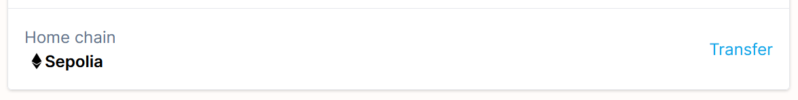

# Proof Humanity 2.0 Tutorial ( Transferring a Profile)

PoH ID is live on both Ethereum mainnet and Gnosis chain, and you have the option to transfer from one chain to another using the same steps as below:

* First, go to your profile page and click "Transfer"&#x20;

<figure><figcaption>
a sample from a Sepolia testnet profile
</figcaption></figure>

* A transfer prompt will then appear for a reminder and to confirm your transfer request.

<figure><figcaption></figcaption></figure>

* Once the transaction is confirmed, your profile status will change from "Registered" to "Pending Update". You will then need to change your network connection to the network you want the profile to be transferred to. Once your wallet is connected to the new desired chain, go to your profile page and click "Update state".&#x20;

<figure><figcaption></figcaption></figure>

* An update prompt will appear where you should initiate the "Relay State Update" option and confirm the transaction.

<figure><figcaption>
a sample from a Sepolia testnet profile
</figcaption></figure>


Make sure that you have enough funds to transact on your desired new chain to update or complete the profile transfer


* Once the transaction is validated, your current profile request status will be in "Resolved Claim" with the icon of the new network it's included in, while the immediate past profile request status will change to "Transferred"

<figure><figcaption></figcaption></figure>

 

<figure><figcaption></figcaption></figure>

