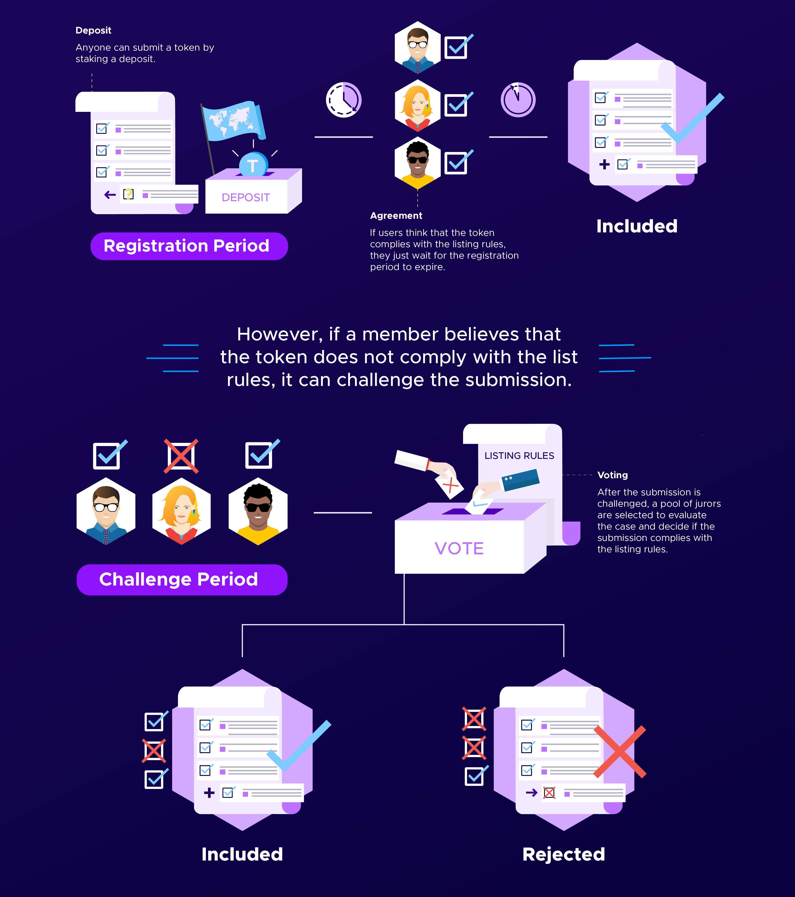

# Tokens

🟣 [Kleros Tokens Registry](https://curate.kleros.io/tcr/100/0xeE1502e29795Ef6C2D60F8D7120596abE3baD990) 🟣

**Kleros Tokens** is an open and decentralized curated registry of tokens. In other words, it is a community-managed list of ERC-20 tokens (including their name, ticker, logo and address) open to any project and curated by the power of Kleros arbitration and economic incentives.

<figure><figcaption></figcaption></figure>

## Why does the ecosystem need a decentralized and open list of tokens?

As the Ethereum ecosystem continues to evolve, the rate at which new ERC-20 tokens are being created is expected to accelerate. With this, it becomes increasingly difficult for users to filter out high quality, legitimate tokens from scams, fakes, and duplicates.&#x20;

Many projects have taken to managing and maintaining their own token lists and the end result is a lot of duplicated work and drawn out listing processes which fail to keep pace with the developments in the market. In addition, builders should be able to focus on building, not deciding which tokens are legitimate.

**Kleros Tokens** is a solution to this problem: a community-managed initiative to improve discoverability and trust in ERC20 tokens in a manner that is inclusive, transparent, and decentralized.

## Decentralizing the listing and curation process for tokens

In the legacy financial system, gatekeepers manage the lists of assets on a discretionary basis. Without listing, the utility of an asset is severely diminished. Unlisted assets often can’t be transferred, traded or used in any other capacity.&#x20;

In the Ethereum-based decentralized financial system, the concept of “listing” takes on a new meaning. Anyone can create a new ERC-20 token and transfer it to anyone else, and it will be publicly recorded on the Ethereum blockchain.

Since most fungible tokens nowadays use a standard interface (e.g. ERC-20), infrastructure-layer applications, such as wallets, analytics sites, and DeFi protocols (like Uniswap) can immediately recognize and interact with new ERC20 tokens from the moment they are deployed.

As the decentralized finance movement continues to remove gatekeepers, it is imperative that new systems for discovery and reputation do not devolve into centralized gatekeeping, which is why Kleros Tokens registry is designed to be completely open and transparent.

## How does it work?

Anyone can submit a token and its information with a deposit. The submission goes through a challenge period.

* If no one challenges it, it is automatically accepted into the list.
* If someone challenges it by putting up a deposit, then it goes to Kleros Court for arbitration.

It is also possible to make a removal request for an entry already accepted into the registry.

The full instructions for how to submit to the registry can be found [here](https://blog.kleros.io/how-to-submitting-to-the-security-metadata-registries-on-kleros-curate/).

## What type of information is stored in the Tokens registry

### Tokens

The Tokens registry contract contains all token submissions. A token submission contains the token's data its current status and request history.

* Name - The token's name (e.g. Gnosis).
* Ticker - The token's ticker (e.g. GNO).
* Address - The token's address
* Decimals - The number of decimals that the token can denote
* Logo  - The token logo image

## Use cases

Kleros Tokens is already one of the most popular [Token Lists](https://tokenlists.org) (and the only decentralized one) and is thus used by the likes of Uniswap, Sushiswap, Zerion, Swapr etc... as a way to list tokens in their application.
